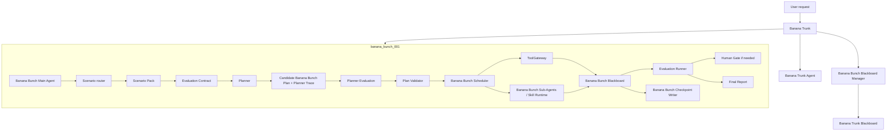

# Power Banana Current Design

Status: Current  
Last updated: 2026-06-13
Implementation authority: This document is the source of truth for future Power Banana implementation work.

## Purpose

Power Banana is a governed enterprise-agent runtime design for multiple application scenarios. Its near-term goal is not to choose a single product scenario too early. Its near-term goal is to prove that a reusable runtime kernel can host governed business workflows that are planned, executed, evaluated, audited, paused for human approval, and expanded through explicit scenario policy.

This document consolidates the current valid design decisions from the existing Power Banana and AgentX design documents. Older documents remain useful references, but future implementation should follow this document unless it is explicitly updated.

## Design Status

Power Banana is currently in the design-convergence stage.

The repository may contain earlier runtime prototypes, evaluation cases, and design experiments. Those artifacts should be treated as reference material until the current design is complete enough to drive a fresh implementation pass.

## Source Documents

The current design is distilled from:

- `docs/enterprise_agent_design_v0.3.md`
- `docs/superpowers/specs/2026-06-11-skill-governed-runtime-design.md`
- `docs/superpowers/specs/2026-06-11-powerbanana-memory-system-design.md`
- `docs/superpowers/specs/2026-06-13-powerbanana-scenario-contract-migration-design.md`
- `docs/superpowers/specs/2026-06-13-powerbanana-scenario-agnostic-runtime-contract-design.md`
- Earlier vocabulary, golden-case, and analysis-request specs under `docs/superpowers/specs/`

When these documents conflict, this current design wins.

The earlier `docs/superpowers/specs/2026-06-12-powerbanana-near-term-design-adjustment.md` document is retained as historical context only. Its assumption that the current data-analysis path should become the first enabled Scenario Pack has been superseded. The current direction is runtime-kernel first, with the data-analysis path treated as a reference prototype until a real first application scenario is selected.

## Product Positioning

Power Banana should be designed as:

- A governed workflow agent for repeatable enterprise tasks.
- A scenario-based runtime where business behavior is declared through Scenario Packs.
- A system that treats uploaded data, user instructions, LLM output, and memory as separately trusted inputs.
- A reusable runtime kernel that can support multiple fixed, semi-fixed, or governed autonomous business workflows.
- A platform where the current data-analysis code path is a reference prototype and regression fixture, not the selected first product scenario.

Power Banana should not be designed as:

- An open-ended autonomous assistant.
- A general BI platform.
- A general SQL/database analytics engine.
- A memory-driven business knowledge system.
- A system where LLM suggestions become active without validation and human approval.
- A product whose core runtime is shaped around one assumed first application scenario.

## Core Principle

The runtime kernel owns governance. Scenario Packs own business configuration.

Scenario Packs can declare what a scenario is allowed to do. They cannot bypass planning, validation, tool mediation, blackboard writes, evaluation, human gates, or final report assembly.

## Power Banana Tree Runtime

Power Banana should use a tree-shaped runtime model.

The whole runtime is the `Power Banana Tree`. The global coordination layer is the `Banana Trunk`. Each active business task is one `Banana Bunch` identified by `banana_bunch_<id>`.

```text
Power Banana Tree
   ├── Banana Trunk
   │      ├── Banana Trunk Agent
   │      ├── Banana Bunch Blackboard Manager
   │      └── Banana Trunk Blackboard
   │
   ├── banana_bunch_001
   │      ├── Banana Bunch Main Agent
   │      ├── Banana Bunch Sub-Agents
   │      └── Banana Bunch Blackboard
   │
   ├── banana_bunch_002
   │      ├── Banana Bunch Main Agent
   │      ├── Banana Bunch Sub-Agents
   │      └── Banana Bunch Blackboard
   │
   └── banana_bunch_N
          ├── Banana Bunch Main Agent
          ├── Banana Bunch Sub-Agents
          └── Banana Bunch Blackboard
```

The design rule is:

```text
One tree, many Banana Bunches. One Banana Bunch, one business task. One Banana Bunch, one Banana Bunch Blackboard.
```

Banana Trunk connects all Banana Bunches, but each Banana Bunch keeps its own Banana Bunch Blackboard.

## Banana Bunch Identity

Every business task should receive a stable Banana Bunch id:

```yaml
banana_bunch_id: banana_bunch_001
scenario_id: pending_scenario_binding
banana_bunch_status: running
banana_bunch_main_agent_id: banana_bunch_main_agent@banana_bunch_001
banana_bunch_blackboard_ref: bunch-blackboard://banana_bunch_001
banana_bunch_checkpoint_ref: bunch-checkpoint-writer://banana_bunch_001
```

The `banana_bunch_id` is the task-run identity. Older documents may use `task_id` or `TaskRun`; in the current design, those concepts map to `banana_bunch_id` and a single Banana Bunch runtime instance.

## Product And Engineering Name

Power Banana uses separate naming rules for product language and engineering identifiers.

| Context | Name |
|---|---|
| Brand and product | `Power Banana` |
| Human-facing architecture names | `Power Banana Tree`, `Banana Trunk`, `Banana Bunch` |
| Python package and CLI command | `powerbanana` |
| Class and public API prefix | `PowerBanana` |
| Environment/config prefix | `POWERBANANA_` |
| Repository paths and filenames | `powerbanana` where a machine-safe token is needed |

The product name should read as `Power Banana` in prose, headings, UI copy, and user-facing documentation. Machine-facing identifiers should stay compact and stable.

## Naming Convention

Power Banana should use full Banana-prefixed names for formal definitions, diagrams, schemas, and cross-document references. Inside a local section, after the full name appears once, the document may use a shorter alias.

| Formal Name | Local Alias | Machine ID | URI Scheme |
|---|---|---|---|
| Power Banana Tree | Tree | `powerbanana_tree` | `powerbanana-tree://` |
| Banana Trunk | Trunk | `banana_trunk` | `banana-trunk://` |
| Banana Trunk Agent | Trunk Agent | `trunk_agent` | `trunk-agent://` |
| Banana Trunk Blackboard | Trunk Blackboard | `trunk_blackboard` | `trunk-blackboard://` |
| Banana Bunch | Bunch | `banana_bunch_<id>` | `banana-bunch://` |
| Banana Bunch Registry | Bunch Registry | `bunch_registry` | `bunch-registry://` |
| Banana Bunch Main Agent | Bunch Main Agent | `bunch_main_agent@banana_bunch_<id>` | `bunch-main-agent://` |
| Banana Bunch Sub-Agent | Bunch Sub-Agent | `<sub_agent_id>@banana_bunch_<id>` | `bunch-sub-agent://` |
| Banana Bunch Blackboard | Bunch Blackboard | `bunch_blackboard@banana_bunch_<id>` | `bunch-blackboard://` |
| Banana Bunch Blackboard Manager | Bunch Blackboard Manager | `bunch_blackboard_manager` | `bunch-blackboard-manager://` |
| Banana Bunch Checkpoint Writer | Bunch Checkpoint Writer | `bunch_checkpoint_writer@banana_bunch_<id>` | `bunch-checkpoint-writer://` |

Naming rules:

- Human-facing names use Title Case with spaces.
- Machine-facing ids use `snake_case`.
- URI schemes use `kebab-case`.
- A section should use the formal name on first mention, then the local alias when the scope is clear.

## Banana Trunk

Banana Trunk is the global coordination layer. It should manage Banana Bunches, not perform the business work inside a Banana Bunch.

The Trunk owns:

- Creating new `banana_bunch_<id>` task instances.
- Selecting or confirming the Scenario Pack for each Bunch.
- Maintaining the Bunch Registry.
- Deciding whether Bunches run immediately, wait in a queue, pause, resume, or stop.
- Enforcing global concurrency and resource limits.
- Coordinating user-visible status across all Bunches.
- Routing cross-bunch queries through controlled summary references.
- Preventing one Bunch from reading or writing another Bunch's private Bunch Blackboard.

The Trunk must not:

- Execute scenario-specific business steps directly.
- Merge all Bunch Blackboards into one shared business blackboard.
- Use one Bunch's evidence as another Bunch's evidence without an explicit cross-bunch reference and evaluation rule.
- Override a Bunch's Human Gates, Evaluation results, or Scenario Pack policy.

## Banana Trunk Agent

Banana Trunk Agent is the management agent for the whole Power Banana Tree.

The Trunk Agent answers questions such as:

- Which Bunches are running?
- Which Bunches are waiting?
- Which Bunches are blocked?
- Which Bunches need user approval?
- Which resources are locked?
- Which Bunch should receive a new user message?
- Should a high-priority Bunch pause a lower-priority Bunch?

The Trunk Agent should speak to the user about global task state, but it should not impersonate a Bunch Main Agent's business judgment. If the user asks about a specific Bunch's answer, the Trunk Agent should route to that Bunch's evaluated report or summary.

## Banana Trunk Scheduling Model

Banana Trunk scheduling decides which Banana Bunch may advance next. It coordinates many Bunches, but it does not execute the business plan inside any Bunch.

The scheduler should use a conservative default:

- Multiple Banana Bunches may exist at the same time.
- An initial runtime implementation may run only one active Bunch at a time with `max_running_bunches = 1`.
- Additional Bunches wait in Trunk-managed queues until lifecycle state, priority, and resource locks allow them to run.
- Future implementations may raise the running limit when Scenario Pack policies and resource locks prove the Bunches are independent.

### Scheduler Inputs

Banana Trunk scheduling uses only metadata-level inputs:

| Input | Source | Purpose |
|---|---|---|
| Bunch lifecycle state | Bunch Registry and Trunk Blackboard | Know whether a Bunch is runnable, paused, waiting, or terminal. |
| Priority | User request, Scenario Pack default, or Trunk policy | Decide ordering when multiple Bunches are ready. |
| Arrival time | Bunch Registry | Preserve FIFO behavior inside the same priority. |
| Pending Human Gates | Trunk Blackboard summaries | Avoid running Bunches that need user input. |
| Resource lock requests | Frozen plan metadata or Scenario Pack policy | Prevent unsafe concurrent access to shared tools, files, datasets, budgets, or user attention. |
| Checkpoint refs | Bunch Checkpoint Writer | Pause or resume only at durable boundaries. |

The scheduler should not inspect raw Bunch artifacts to make these decisions. If it needs business evidence to compare Bunches, that is a cross-bunch access request, not a scheduling decision.

### Queue Lanes

Banana Trunk should track Bunches in clear lanes:

| Lane | Contains | Scheduler Behavior |
|---|---|---|
| `intake` | Newly created Bunches before scenario binding | Route to Bunch Main Agent for scenario selection. |
| `ready` | `plan_frozen` or resumable `paused` Bunches with no blocking gate | Eligible for admission to `running`. |
| `running` | Bunches currently executing | Counted against `max_running_bunches` and resource locks. |
| `waiting_for_human` | Bunches blocked by Human Gate | Excluded from autonomous scheduling. |
| `paused` | Bunches intentionally paused by Trunk | May return to `ready` when pause reason clears. |
| `terminal` | `planner_blocked`, `partial`, `completed`, `blocked`, `failed`, or `cancelled` Bunches | Not scheduled again without a new attempt or derived Bunch. |

The lane is derived from lifecycle state. It should not become a second, conflicting status model.

### Priority Policy

Priority should be explicit and boring:

| Priority | Use Case |
|---|---|
| `urgent` | User is waiting interactively or explicitly escalated the Bunch. |
| `normal` | Default business task. |
| `background` | Long-running or non-interactive work. |

Within the same priority, scheduling should be FIFO by Bunch creation time or last-ready time. To avoid starvation, a `background` Bunch that waits too long may be promoted to `normal` by Trunk policy, but promotion must be recorded as a schedule decision.

Preemption should be checkpoint-only. A higher-priority Bunch may cause a lower-priority Bunch to pause only after the lower-priority Bunch reaches a checkpoint-safe boundary. The Trunk must not interrupt a tool call or rewrite a Bunch Blackboard to force preemption.

### Resource Locks

Resource locks protect shared external surfaces without merging Bunch state.

Common lock types:

| Lock Type | Example | Conflict Rule |
|---|---|---|
| `user_attention` | A Bunch needs an answer to a Human Gate. | Only one active prompt should be foregrounded unless the user asks to see all gates. |
| `tool:<tool_id>` | `tool:shell`, `tool:browser`, `tool:github` | Exclusive when the tool has shared mutable state; shared when declared read-only. |
| `dataset:<fingerprint>` | A local uploaded file or cached dataset snapshot | Shared reads allowed; writes require exclusive lock. |
| `file:<path>` | Workspace artifact or generated report | Shared reads allowed; writes require exclusive lock. |
| `budget:<provider>` | LLM, API, or paid service budget | Counted against global budget limits. |
| `workspace_write` | Any operation that mutates repository files | Exclusive by default in early implementations. |

A Bunch requests locks through its frozen plan metadata or Scenario Pack policy. The Trunk grants or denies locks at admission time and records the decision. A Bunch Sub-Agent must still access tools through ToolGateway; a Trunk lock is admission control, not tool permission.

### User Message Routing

When a user sends a new message while Bunches are active, Banana Trunk should route it before any Bunch acts:

```text
new user message
-> explicit banana_bunch_<id> mentioned?
   -> route to that Bunch if it is not terminal
-> pending Human Gate expects an answer?
   -> route to the matching gate
-> message changes the scope of an active Bunch?
   -> create a Human Gate or pause that Bunch for clarification
-> message describes a distinct business task?
   -> create a new Banana Bunch
-> still ambiguous?
   -> ask the user to choose existing Bunch or new Bunch
```

The Trunk should prefer creating a new Bunch when the message introduces a distinct business objective, dataset, decision, or scenario. It should prefer routing to an existing Bunch when the message clarifies, approves, cancels, or asks about that Bunch.

### Schedule Decision Record

Every non-trivial scheduling decision should be recorded on the Trunk Blackboard:

```yaml
banana_trunk_schedule_decision:
  decision_id: trunk_schedule_001
  banana_bunch_id: banana_bunch_002
  previous_lifecycle_state: plan_frozen
  decision: admit_to_running
  priority: normal
  reason: running_capacity_available
  required_locks:
    - dataset:sales_2026_06_snapshot
    - workspace_write
  granted_locks:
    - dataset:sales_2026_06_snapshot
    - workspace_write
  denied_locks: []
  created_at: 2026-06-12T00:00:00Z
```

Schedule records are Trunk metadata. They may reference Bunch ids, lifecycle states, priorities, gates, locks, and checkpoint refs, but they should not embed raw Bunch evidence.

## Banana Trunk And Bunch Event Protocol

Banana Trunk and Banana Bunches should communicate through explicit events. Events are control-plane messages, not a shared business blackboard and not direct access to another Bunch's private evidence.

The event protocol has five rules:

1. **Events move control intent and status.** Business artifacts stay in the owning Bunch Blackboard.
2. **Events carry refs, not raw evidence.** Payloads may include ids, lifecycle states, checkpoint refs, gate refs, lock refs, and report refs.
3. **Every event is attributable.** The sender, target, Bunch id, correlation id, and timestamp must be recorded.
4. **Every state-changing event is idempotent.** Replaying the same event must not duplicate business artifacts or create conflicting lifecycle transitions.
5. **Events are auditable.** Accepted and rejected events should leave metadata records on the Trunk Blackboard or the owning Bunch Blackboard.

### Event Envelope

All Trunk-Bunch events should share a common envelope:

```yaml
banana_tree_event:
  event_id: banana_event_001
  event_type: bunch.admit_requested
  source: banana_trunk
  target: banana_bunch_001
  banana_bunch_id: banana_bunch_001
  correlation_id: user_request_2026_06_12_001
  causation_id: trunk_schedule_001
  lifecycle_state: plan_frozen
  payload_ref: trunk-event-payload://banana_event_001
  created_at: 2026-06-12T00:00:00Z
```

The envelope is metadata. If a payload needs detail, the payload should still contain references and small control fields, not raw datasets, raw tool output, or hidden chain-of-thought.

### Event Directions

| Direction | Purpose | Examples |
|---|---|---|
| Trunk -> Bunch | Admit, pause, resume, cancel, route user decision, grant locks | `bunch.admit_requested`, `bunch.pause_requested` |
| Bunch -> Trunk | Report lifecycle change, request locks, announce gate, report completion | `bunch.lifecycle_changed`, `bunch.human_gate_opened` |
| Trunk -> User | Ask for routing, approval, clarification, or priority decision | `user.routing_choice_requested`, `user.human_gate_prompted` |
| User -> Trunk | New task, clarification, approval, cancellation, priority change | `user.message_received`, `user.gate_decision_received` |
| Bunch -> Bunch | Not allowed directly | Use Trunk-mediated cross-bunch access instead |

A Bunch Main Agent should not send events directly to another Bunch Main Agent. Cross-bunch coordination always goes through Banana Trunk and the Bunch Blackboard Manager.

### Core Event Types

| Event Type | Direction | Meaning |
|---|---|---|
| `bunch.create_requested` | User or Trunk -> Trunk | A new business task may need a new Banana Bunch. |
| `bunch.created` | Trunk -> Trunk Blackboard | A `banana_bunch_<id>` record was created. |
| `bunch.scenario_bound` | Bunch -> Trunk | Scenario Pack and Evaluation Contract are selected. |
| `bunch.plan_frozen` | Bunch -> Trunk | The Bunch has a valid frozen plan and may enter the `ready` lane. |
| `bunch.lock_requested` | Bunch -> Trunk | The Bunch requests resource locks for admission. |
| `bunch.lock_granted` | Trunk -> Bunch | The Bunch may execute with listed locks. |
| `bunch.lock_denied` | Trunk -> Bunch | The Bunch must wait, revise, or enter a blocked path. |
| `bunch.admit_requested` | Trunk -> Bunch | The scheduler admits the Bunch to `running`. |
| `bunch.pause_requested` | Trunk -> Bunch | The Bunch should pause at the next checkpoint-safe boundary. |
| `bunch.paused` | Bunch -> Trunk | The Bunch reached a checkpoint-safe paused state. |
| `bunch.resume_requested` | Trunk -> Bunch | The Bunch may resume from `paused` or `waiting_for_human`. |
| `bunch.human_gate_opened` | Bunch -> Trunk | The Bunch needs user input or approval. |
| `bunch.human_gate_resolved` | Trunk -> Bunch | The user decision or clarification is available. |
| `bunch.lifecycle_changed` | Bunch or Trunk -> Trunk | The Bunch lifecycle state changed with a checkpoint ref. |
| `bunch.completed` | Bunch -> Trunk | The Bunch produced an evaluated final report. |
| `bunch.partial_returned` | Bunch -> Trunk | The Bunch produced an evaluated partial report. |
| `bunch.blocked` | Bunch -> Trunk | The Bunch cannot continue because of policy, evidence, or business constraints. |
| `bunch.failed` | Runtime Kernel -> Trunk | A runtime or system failure affected the Bunch. |
| `bunch.cancel_requested` | User or Trunk -> Bunch | The Bunch should stop and record cancellation. |
| `cross_bunch.access_requested` | Trunk -> Bunch Blackboard Manager | A mediated cross-bunch read is requested. |
| `cross_bunch.access_granted` | Bunch Blackboard Manager -> Trunk | Approved refs are available for a cross-bunch view. |
| `cross_bunch.access_denied` | Bunch Blackboard Manager -> Trunk | The request violates policy or needs a Human Gate. |

### Delivery Semantics

The initial runtime implementation should treat events as durable append-only records with at-least-once delivery semantics:

- The receiver must deduplicate by `event_id`.
- The receiver must reject stale events that conflict with the current lifecycle state.
- Events that change lifecycle state must include the expected previous state or checkpoint ref.
- A failed handler may be retried, but retry must not create duplicate Bunch artifacts.
- Event ordering is guaranteed only within one `banana_bunch_id`; cross-Bunch ordering should be inferred from timestamps and schedule records.

This keeps the protocol simple while still allowing future replacement with a queue or message bus if needed.

### Event Rejection

An event should be rejected when:

- The target Bunch id does not exist.
- The event targets a terminal Bunch without creating a new attempt or derived Bunch.
- The expected lifecycle state does not match the current lifecycle state.
- The sender is not authorized for the event type.
- The payload contains raw business evidence that belongs in a Bunch Blackboard.
- The event would create cross-bunch access without a cross-bunch access record.
- The event asks a Bunch to bypass ToolGateway, Evaluation Contract, Human Gate, or resource locks.

Rejected events should produce a small rejection record with `event_id`, `reason`, `source`, `target`, and current lifecycle state.

### Event Naming

Event names should use `domain.action_result` or `domain.action_requested`:

- `bunch.created`
- `bunch.pause_requested`
- `bunch.human_gate_opened`
- `cross_bunch.access_requested`
- `user.routing_choice_requested`

Use past tense for facts that already happened, and `_requested` for commands that a receiver may accept, delay, or reject.

## Banana Bunch Blackboard Manager

Banana Bunch Blackboard Manager manages many Banana Bunch Blackboards.

The Bunch Blackboard Manager owns:

- `banana_bunch_id -> Bunch Blackboard` lookup.
- Bunch Blackboard creation.
- Bunch Blackboard lifecycle state.
- Access control between Bunches.
- Global status summaries.
- Cross-bunch references.
- Trunk Blackboard updates.

The Banana Trunk Blackboard stores only global metadata:

- Active Bunch ids.
- Scenario id per Bunch.
- Status per Bunch.
- Pending Human Gates per Bunch.
- Resource locks.
- Checkpoint refs.
- Final report refs.

The Trunk Blackboard should not store raw business evidence from each Bunch. Business evidence belongs in the individual Bunch Blackboard for that Bunch.

## Trunk And Bunch Permission Model

Power Banana should use default isolation between Bunches. The Trunk can coordinate Bunches, but it cannot freely inspect or merge their private business evidence.

The permission model has five rules:

1. **Default isolation.** A Bunch can read and write only its own Bunch Blackboard.
2. **Trunk metadata access.** The Trunk can read Bunch metadata, status, gates, checkpoint refs, and final report refs.
3. **Evidence stays local.** Raw business evidence, tool outputs, intermediate artifacts, and evaluator internals stay in the source Bunch Blackboard unless explicitly shared by policy.
4. **Cross-bunch access is mediated.** Any cross-bunch read must go through the Bunch Blackboard Manager and produce an audit record.
5. **Cross-bunch writes are forbidden.** One Bunch must never write to another Bunch's Bunch Blackboard.

### Permission Matrix

| Actor | May Read | May Write | Must Not |
|---|---|---|---|
| Trunk Agent | Trunk Blackboard; Bunch registry; Bunch status; pending gates; checkpoint refs; final report refs; approved Bunch summaries | Trunk Blackboard metadata; routing decisions; queue and priority state | Read raw Bunch evidence by default; write Bunch artifacts; override Bunch evaluation |
| Bunch Blackboard Manager | Bunch Blackboard metadata; access-control records; approved cross-bunch refs | Bunch Blackboard lifecycle metadata; Trunk Blackboard summaries; audit entries for access | Rewrite business artifacts; merge Bunch Blackboards |
| Bunch Main Agent | Its own Bunch Blackboard; its Scenario Pack; its Evaluation Contract; approved Trunk messages routed to its Bunch | Its own Bunch Blackboard artifacts, gates, traces, and final report | Read or write another Bunch Blackboard directly |
| Bunch Sub-Agent | Explicit input refs from its own Bunch Main Agent; allowed tools; scoped context bundle | Declared output refs in its own Bunch Blackboard | Talk to the user directly; access another Bunch; bypass ToolGateway |
| Evaluation Runner | Current Bunch artifacts required by the active Evaluation Contract | Evaluation entries in the current Bunch Blackboard | Evaluate another Bunch unless invoked through a cross-bunch evaluation policy |
| Bunch Checkpoint Writer | Current Bunch status, gates, plan refs, checkpoint refs | Current Bunch checkpoint-owned files | Write business artifacts; write another Bunch checkpoint |
| User | Trunk summaries; final reports; pending Human Gate prompts; explicitly requested Bunch details allowed by policy | User decisions and clarifications through Human Gates | Directly mutate Bunch Blackboard artifacts |

### Trunk Read Levels

The Trunk should support three read levels:

| Read Level | Trunk Can Access | Example |
|---|---|---|
| `status` | Bunch id, scenario id, status, priority, pending gates, timestamps | "Which Bunches are blocked?" |
| `summary` | Evaluated answer summary, final report ref, limitations, warnings | "Show summaries for today's Bunches." |
| `evidence_ref` | Specific artifact refs, evaluator refs, and source refs approved for cross-bunch comparison | "Compare the final revenue result in two Bunches." |

The default read level is `status`. `summary` requires the source Bunch to have an evaluated report or an explicit partial report. `evidence_ref` requires an explicit user request or Scenario Pack policy and must create an audit entry.

### Cross-Bunch Access Flow

When a user or Trunk Agent asks to compare or reference multiple Bunches, the runtime should follow this flow:

```text
request cross-bunch view
-> identify source Bunches
-> check requester role and read level
-> check each source Bunch status and Evaluation result
-> ask Human Gate if policy requires approval
-> create cross-bunch access record
-> expose summaries or refs, not raw artifacts by default
-> run cross-bunch evaluator if the output makes a new claim
```

A cross-bunch view may cite multiple Bunches, but it should not become a hidden shared blackboard. It is a derived report or summary with explicit source refs.

### Cross-Bunch Access Record

Every cross-bunch read beyond `status` should create a record:

```yaml
cross_bunch_access:
  access_id: cross_bunch_access_001
  requester: trunk_agent
  purpose: compare_final_reports
  read_level: summary
  source_bunches:
    - banana_bunch_001
    - banana_bunch_002
  allowed_refs:
    - bunch-report://banana_bunch_001/final
    - bunch-report://banana_bunch_002/final
  gate_ref: ""
  created_at: 2026-06-12T00:00:00Z
```

If the access uses `evidence_ref`, `allowed_refs` must list the exact artifact or evaluator refs. Broad access such as "all artifacts from banana_bunch_001" should be rejected.

### Human Gate Requirements

Cross-bunch access should require a Human Gate when:

- The target output compares business conclusions across Bunches.
- A source Bunch is `partial`, `blocked`, or `waiting_for_human`, or its latest gate action is `needs_clarification`.
- The access needs `evidence_ref` level.
- The Scenario Pack marks the Bunch data as sensitive.
- The request would expose raw user-uploaded data or raw tool output.

Status-level monitoring should not require a Human Gate.

### Forbidden Operations

The permission model must reject:

- A Bunch Main Agent reading another Bunch Blackboard directly.
- A Bunch Sub-Agent reading or writing outside its Bunch.
- Trunk Agent rewriting Bunch artifacts.
- Trunk Blackboard storing raw business evidence.
- Cross-bunch comparison that creates a new business claim without evaluation.
- Memory using one Bunch's evidence to influence another Bunch without an explicit cross-bunch access record.

## Banana Bunch Lifecycle

Each Banana Bunch should have one explicit lifecycle state. The lifecycle belongs to the Bunch record managed by Banana Trunk, but state transitions must be justified by the active Bunch Main Agent, Evaluation Runner, Human Gate, or Trunk coordination policy.

The lifecycle has two purposes:

- Let Banana Trunk schedule many Banana Bunches without inspecting private Bunch evidence.
- Let each Banana Bunch prove where it is in the work, why it moved there, and what checkpoint captured the transition.

### Lifecycle States

| State | Meaning | Typical Owner |
|---|---|---|
| `created` | The Bunch record exists, but no scenario has been bound yet. | Banana Trunk |
| `scenario_bound` | Scenario Pack and Evaluation Contract have been selected. | Bunch Main Agent |
| `planning` | The Planner is producing or revising a candidate Banana Bunch Plan. | Bunch Main Agent |
| `planner_blocked` | Planning cannot continue because planner evaluation or policy failed before execution. | Evaluation Runner |
| `plan_frozen` | A valid plan has been frozen and is ready for execution. | Bunch Main Agent |
| `running` | The Bunch is executing its frozen plan through the Bunch scheduler and ToolGateway. | Bunch Main Agent |
| `waiting_for_human` | Execution is paused by a Human Gate and cannot continue autonomously. | Human Gate |
| `paused` | Banana Trunk intentionally paused the Bunch for scheduling, priority, or resource reasons. | Banana Trunk |
| `partial` | The Bunch produced an evaluated partial result with explicit limitations. | Evaluation Runner |
| `completed` | The Bunch produced a final evaluated report. | Evaluation Runner |
| `blocked` | The Bunch stopped because policy, evidence, or business constraints prevent a valid answer. | Evaluation Runner |
| `failed` | Runtime or system failure prevented reliable completion. | Runtime Kernel |
| `cancelled` | The user or Banana Trunk cancelled the Bunch. | User or Banana Trunk |

Terminal states are `planner_blocked`, `partial`, `completed`, `blocked`, `failed`, and `cancelled`. Terminal Bunches are read-only for business artifacts. The Trunk may still append metadata such as archival notes, cross-bunch access records, and final status references.

### State Transitions

The default transition path is:

```text
created
-> scenario_bound
-> planning
-> plan_frozen
-> running
-> completed
```

The runtime should also allow these controlled transitions:

```text
planning -> planner_blocked
running -> waiting_for_human -> running
running -> paused -> running
running -> partial
running -> blocked
running -> failed
created | scenario_bound | planning | plan_frozen | running | waiting_for_human | paused -> cancelled
```

No component should skip directly from `created` to `running`, from `planning` to `completed`, or from any terminal state back into active execution. A retry after a terminal state should create a new attempt record or a new Banana Bunch derived from the original Bunch, preserving the original evidence and audit trail.

### Transition Authority

| Transition Type | Authorized Actor | Required Evidence |
|---|---|---|
| Create Bunch | Banana Trunk | User request, task boundary, generated `banana_bunch_<id>` |
| Bind scenario | Bunch Main Agent | Scenario Pack id, Evaluation Contract id, scenario selection trace |
| Enter planning | Bunch Main Agent | Planner input refs and trusted context bundle refs |
| Freeze plan | Bunch Main Agent with Evaluation Runner approval | Candidate plan, planner trace, planner evaluation result |
| Enter running | Bunch Main Agent | Frozen plan ref and scheduler admission |
| Enter `waiting_for_human` | Human Gate or Evaluation Runner | Gate reason, prompt, required decision |
| Resume from `waiting_for_human` | Human Gate | User decision or clarification ref |
| Pause or resume Bunch | Banana Trunk | Scheduling reason, resource reason, or user request |
| Mark `partial`, `completed`, or `blocked` | Evaluation Runner | Evaluation result, final or partial report ref, limitation refs |
| Mark `failed` | Runtime Kernel | Failure trace and affected component |
| Mark `cancelled` | User or Banana Trunk | Cancellation reason |

Banana Trunk may pause, resume, prioritize, or cancel a Bunch. It must not mark a Bunch as `completed` unless the source Bunch Evaluation Runner has produced the evaluated final report.

### State-Based Write Rules

| State Group | Bunch Blackboard Writes | Trunk Blackboard Writes |
|---|---|---|
| `created` | None except Bunch initialization metadata | Bunch registry and queue metadata |
| `scenario_bound` | Scenario refs and Evaluation Contract refs | Scenario id and lifecycle status |
| `planning` | Planner inputs, candidate plan refs, Planner Trace refs | Status, timestamps, checkpoint refs |
| `plan_frozen` | Frozen plan and validation refs | Status, scheduler readiness |
| `running` | Tool outputs, Sub-Agent artifacts, evaluation entries, gates, reports | Status, resource locks, checkpoint refs |
| `waiting_for_human` | Gate prompt, gate context, user decision refs | Pending gate summary |
| `paused` | No new business artifacts while paused | Pause reason, priority, resource state |
| Terminal states | Final report, partial report, block reason, failure trace, or cancellation record only | Final status, final report ref, archival metadata |

The Bunch Checkpoint Writer writes checkpoint-owned files on every transition, but it does not decide the transition.

### Lifecycle Checkpoint Record

Every state transition should append a lifecycle checkpoint record:

```yaml
banana_bunch_lifecycle:
  banana_bunch_id: banana_bunch_001
  previous_status: running
  next_status: waiting_for_human
  transition_reason: human_gate_created
  actor: bunch_main_agent@banana_bunch_001
  checkpoint_ref: bunch-checkpoint-writer://banana_bunch_001/latest
  created_at: 2026-06-12T00:00:00Z
```

The Trunk reads lifecycle state through `status` level access by default. It should not need raw Bunch artifacts to know whether a Bunch is ready, running, paused, waiting for the user, or finished.

## Banana Bunch Main Agent And Banana Bunch Sub-Agents

Each `banana_bunch_<id>` owns one Banana Bunch Main Agent instance.

The Bunch Main Agent is the task-local coordinator. It owns the work inside one Bunch:

- Interpreting the business request within the selected Scenario Pack.
- Requesting a candidate plan from the Planner.
- Supervising Bunch Sub-Agents.
- Ensuring outputs land in the Bunch's own Bunch Blackboard.
- Triggering the required Evaluation Contract.
- Creating Human Gates when needed.
- Producing the Bunch's final evaluated report.

Bunch Sub-Agents are task-local execution participants. Sub-Agent definitions can be reused across Bunches, but each execution belongs to exactly one Bunch.

```text
data_profile_agent@banana_bunch_001
data_profile_agent@banana_bunch_002
```

These are the same sub-agent type running in different Bunch contexts. They must not share private task state.

## Banana Bunch Internal Execution Protocol

Inside one Banana Bunch, execution should follow a stable three-part loop:

```text
Bunch Main Agent
-> issue bunch_task
-> Bunch Sub-Agent executes through ToolGateway
-> Bunch Sub-Agent writes artifact to Bunch Blackboard
-> Evaluation Runner evaluates artifact
-> Bunch Main Agent decides continue, retry, gate, partial, block, or complete
-> Final Report cites evaluated artifacts only
```

This protocol is the industry-agnostic execution core. It defines how a Bunch works, not what a specific industry means. Industry behavior belongs in Scenario Packs, Evaluation Contracts, Domain Vocabulary, Tool Policy, Human Gate Policy, and Artifact Schemas.

### Bunch Task Contract

The Bunch Main Agent should assign structured tasks, not vague natural-language work orders. Each task should be scoped to the active `banana_bunch_<id>` and should be small enough for one Sub-Agent or skill runtime to complete and verify.

```yaml
bunch_task:
  task_id: bunch_task_001
  banana_bunch_id: banana_bunch_001
  assigned_sub_agent: metric_sub_agent@banana_bunch_001
  objective: compute_channel_revenue
  input_refs:
    - dataset-snapshot://banana_bunch_001/sales_2026_06
    - frozen-plan://banana_bunch_001/plan_001
  allowed_tools:
    - dataframe_profile
  expected_artifacts:
    - metric_artifact
  evaluation_requirements:
    - metric_recomputation
    - evidence_ref_coverage
  deadline_or_budget: local_default
  failure_policy: retry_then_partial
```

The Bunch Main Agent may create, revise, retry, or cancel Bunch tasks. It must not silently edit a Sub-Agent artifact to make it pass evaluation.

### Sub-Agent Input And Output Contract

Bunch Sub-Agents should receive refs and declared permissions instead of unrestricted context. A Sub-Agent input bundle may include:

- User request refs.
- Scenario Pack refs.
- Evaluation Contract refs.
- Frozen plan node refs.
- Dataset snapshot refs.
- Upstream artifact refs.
- Tool permission refs.

A Sub-Agent output must be a structured artifact written to the current Bunch Blackboard. Sub-Agents should not return final user-facing answers directly.

Recommended artifact categories:

| Artifact Type | Purpose |
|---|---|
| `analysis_artifact` | A structured reasoning result, comparison, classification, or interpretation. |
| `tool_result_artifact` | A normalized result from an allowed tool call. |
| `metric_artifact` | A computed metric with formula, inputs, and evidence refs. |
| `evidence_artifact` | A cited source, extracted fact, row sample, clause, record, or supporting observation. |
| `warning_artifact` | A limitation, uncertainty, risk, or policy warning. |
| `error_artifact` | A failed task result with recoverable or terminal error information. |

### Bunch Artifact Record

All material Sub-Agent outputs should be written as artifacts on the owning Bunch Blackboard:

```yaml
bunch_artifact:
  artifact_id: artifact_001
  banana_bunch_id: banana_bunch_001
  produced_by: metric_sub_agent@banana_bunch_001
  task_id: bunch_task_001
  artifact_type: metric_artifact
  input_refs:
    - dataset-snapshot://banana_bunch_001/sales_2026_06
  output_ref: bunch-artifact://banana_bunch_001/artifact_001
  confidence: high
  warnings: []
  created_at: 2026-06-13T00:00:00Z
```

The Bunch Blackboard is the evidence store. Final reports should cite artifact refs that have passed the relevant Evaluation Contract checks.

### Evaluation Runner Checkpoints

The Evaluation Runner should not appear only at the end. It has three checkpoints:

| Checkpoint | When It Runs | Purpose |
|---|---|---|
| Plan evaluation | Before `plan_frozen` | Validate intent, scenario fit, policy, and task plan safety. |
| Artifact evaluation | After important artifacts are written | Validate evidence coverage, schema, metric recomputation, source refs, and warnings. |
| Final evaluation | Before final report | Validate that the final answer cites evaluated artifacts and states limitations. |

Evaluation outcomes should map to execution decisions:

| Outcome | Execution Decision |
|---|---|
| `pass` | Continue normally. |
| `pass_with_warning` | Continue and preserve warnings. |
| `needs_more_evidence` | Ask the Bunch Main Agent to create a follow-up task. |
| `needs_clarification` | Create a Human Gate. |
| `return_partial` | Produce an evaluated partial report. |
| `block` | Move the Bunch to `blocked`. |

The Evaluation Runner evaluates. It should not execute tools, mutate source artifacts, or speak directly to the user.

### Human Gate Insertion Points

Human Gates should be used for decisions that need the user, not for routine task coordination.

Create a Human Gate when:

- User intent or task scope is ambiguous.
- Data, source, metric, clause, or policy interpretation conflicts.
- A Sub-Agent needs expanded tool permission.
- Cross-bunch access requires approval.
- Evaluation can only support a partial result.
- A high-impact business conclusion needs confirmation.
- The user message changes the objective enough that a new Bunch may be needed.

Human Gate outputs should be written as decision refs. A Human Gate must not directly mutate artifacts.

### Failure, Retry, And Partial Results

Failures should be typed so the Bunch Main Agent can respond consistently:

| Failure Type | Meaning | Default Handling |
|---|---|---|
| `tool_failure` | Allowed tool failed or timed out. | Retry within budget, then write `error_artifact`. |
| `artifact_invalid` | Artifact failed schema or evaluation checks. | Ask Sub-Agent to revise or produce supporting evidence. |
| `policy_blocked` | Scenario, tool, data, or compliance policy rejects the path. | Stop and move to `blocked`. |
| `insufficient_evidence` | Available evidence cannot support the requested claim. | Ask for more evidence, create Human Gate, or return partial. |

Retries should be bounded. An initial runtime implementation may allow at most two retries per `bunch_task` before the Evaluation Runner decides whether the Bunch should return partial, block, or fail.

### Internal Forbidden Operations

The internal execution protocol must reject:

- A Bunch Sub-Agent speaking directly to the user.
- A Bunch Sub-Agent reading or writing another Bunch's Blackboard.
- A Bunch Sub-Agent bypassing ToolGateway.
- A Bunch Sub-Agent changing the final report directly.
- The Bunch Main Agent putting unevaluated artifacts into the final answer.
- The Evaluation Runner executing tools or rewriting artifacts.
- A Human Gate mutating artifacts instead of producing a decision ref.
- Industry-specific business rules being hard-coded into the core runtime instead of Scenario Packs or Evaluation Contracts.

### Cross-Industry Adaptability

Power Banana should treat the internal execution protocol as a cross-industry runtime skeleton.

Stable across industries:

- Bunch Main Agent coordinates task-local work.
- Bunch Sub-Agents execute authorized tasks.
- Bunch Blackboard stores evidence and artifacts.
- Evaluation Runner checks trust, quality, and policy.
- Human Gate captures human decisions.
- ToolGateway mediates tool access.
- Final Report cites evaluated artifacts only.

Variable by industry:

| Extension Point | Industry-Specific Content |
|---|---|
| Scenario Pack | Task types, allowed Sub-Agents, allowed tools, input shape, concurrency policy. |
| Evaluation Contract | Industry checks, compliance gates, metric rules, source requirements. |
| Domain Vocabulary | Terms, fields, formulas, clauses, codes, risk categories, business definitions. |
| Tool Policy | Tool permissions, approval thresholds, write restrictions, external access rules. |
| Human Gate Policy | Decisions that must involve a user, reviewer, expert, or accountable owner. |
| Artifact Schema | Industry-specific artifact structures such as metrics, clauses, clinical summaries, inspection findings, or financial records. |

Examples:

| Industry Scenario | Specialized Artifacts | Specialized Evaluation |
|---|---|---|
| Sales analysis | `metric_artifact`, `analysis_artifact` | Formula checks, field availability, dataset snapshot consistency. |
| Legal contract review | `clause_artifact`, `risk_artifact` | Clause citation, risk taxonomy, required human review for high-risk terms. |
| Medical assistance | `clinical_summary_artifact`, `evidence_artifact` | Source provenance, limitation disclosure, clinician confirmation gates. |
| Manufacturing quality | `inspection_artifact`, `anomaly_artifact` | Batch traceability, threshold checks, sampling coverage. |
| Finance operations | `reconciliation_artifact`, `exception_artifact` | Ledger consistency, approval policy, audit trail completeness. |

The core runtime should not become a container for industry rules. New industries should be added by extending Scenario Packs, Evaluation Contracts, vocabularies, tools, artifact schemas, and test suites.

## Reference Prototype Status

No first production Scenario Pack is currently selected.

The existing data-analysis workflow should be treated as a reference prototype and regression fixture. It proves useful runtime mechanics, including deterministic planning, plan validation, ToolGateway-mediated data access, Blackboard entries, metric recomputation, Human Gates, and vocabulary approval. It must not define the platform's product scope.

If the prototype is represented as a Scenario Pack for tests, it should be marked `candidate` or `reference`, not assumed to be the first enabled product scenario:

```yaml
scenario_id: sales_channel_analysis
scenario_version: 0.1.0
status: candidate
purpose: Rank a single-table channel metric from an uploaded CSV or simple XLSX file.
supported_file_types:
  - csv
  - xlsx
supported_table_shape: single_table
supported_metrics:
  - conversion_rate
  - revenue
  - orders
  - visits
default_group_by: channel
execution_mode: serial
```

The first enabled production scenario should be chosen later by business priority and validation value. Candidate scenarios include data analysis, contract review, ticket triage, finance review, sales operations, knowledge retrieval, or approval-flow assistance.

## High-Level Architecture



## Runtime Kernel Responsibilities

The runtime kernel includes Banana Trunk plus the per-Banana-Bunch runtime. It is responsible for:

- Capturing user intent and task boundaries.
- Creating and tracking `banana_bunch_<id>` instances.
- Keeping Banana Bunch Blackboards isolated by default.
- Selecting one enabled Scenario Pack.
- Loading the paired Evaluation Contract.
- Building trust-labeled context bundles.
- Requesting candidate plans from the Planner.
- Recording Planner traces before execution.
- Running Planner evaluation before data access when possible.
- Freezing only valid Task Plans.
- Scheduling frozen DAG nodes.
- Mediating all tool access through ToolGateway.
- Requiring material outputs to be written to the active Banana Bunch Blackboard.
- Running required evaluators.
- Creating Human Gates for ambiguity, approval, or unsafe conditions.
- Assembling final reports from evaluated artifacts.
- Writing checkpoint state through Banana Bunch Checkpoint Writer.

The runtime kernel should reject any scenario, skill, planner output, or memory record that attempts to weaken these responsibilities.

The normative runtime records, refs, Scenario Pack statuses, Evaluation Contract gate actions, registry fields, permission roles, error classes, and observability fields are defined in `docs/superpowers/specs/2026-06-13-powerbanana-scenario-agnostic-runtime-contract-design.md`. Future implementation plans should use that supplement before inventing new core object shapes.

## Scenario Pack Responsibilities

A Scenario Pack declares:

- Scenario identity and version.
- Supported task type.
- Allowed planner intents.
- Allowed sub-agents.
- Allowed skills and skill versions.
- Allowed tools and risk level.
- Supported input shape.
- Concurrency policy.
- Required human gates.
- Required golden and calibration suites.
- Paired Evaluation Contract reference.

A Scenario Pack should not contain arbitrary executable code. If executable behavior is needed, it belongs in versioned Skills or registered runtime components.

## Evaluation Contract

Every enabled Scenario Pack must have a paired Evaluation Contract.

Every enabled Evaluation Contract should bind at least these baseline checks:

- Planner intent consistency.
- Input or source snapshot presence and version.
- Required field availability.
- Evidence reference coverage.
- Artifact correctness or scenario-specific recomputation when derived results are produced.
- Context security findings.
- Final report consistency.

The contract defines gate outcomes:

| Gate Action | Meaning |
|---|---|
| `pass` | Continue normally. |
| `pass_with_warning` | Continue, but include warnings. |
| `needs_more_evidence` | Pause until additional evidence is produced or supplied. |
| `return_partial` | Return a partial answer with limitations. |
| `needs_clarification` | Pause for user clarification or approval. |
| `human_review` | Pause for review of risk or policy concerns. |
| `block` | Stop execution and report the blocking reason. |

No scenario may be `enabled` without a valid paired Evaluation Contract.

## Scenario Pack And Evaluation Contract Schema

Scenario Pack and Evaluation Contract definitions should be declaration files. The core runtime loads and validates them; it should not embed industry-specific business logic.

The recommended layout is:

```text
scenarios/
  <scenario_id>/
    scenario.yaml
    evaluation.yaml
    vocabulary.yaml
    artifact_schemas.yaml
    test_suites.yaml
```

The initial runtime implementation may require only `scenario.yaml` and `evaluation.yaml`. The design should still reserve stable refs for vocabulary, artifact schemas, and test suites so application scenarios can be added without changing the runtime kernel.

### Scenario Pack Schema

A Scenario Pack declares the business capability boundary for one scenario.

```yaml
scenario_pack:
  scenario_id: example_business_scenario
  scenario_version: 0.1.0
  status: candidate
  display_name: Example Business Scenario
  purpose: Demonstrate the structure required for a governed enterprise workflow.

  task_classification:
    supported_task_types:
      - governed_business_task
    allowed_planner_intents:
      - supported_business_request
    rejection_intents:
      - unsupported_external_writeback
      - unsupported_realtime_decision

  input_contract:
    supported_file_types:
      - csv
      - txt
      - pdf
      - xlsx
    supported_input_shape: scenario_defined
    required_fields:
      - scenario_defined_required_input
    max_files: 1

  domain_vocabulary_ref: vocabulary.yaml
  artifact_schema_ref: artifact_schemas.yaml
  evaluation_contract_ref: evaluation.yaml

  execution_policy:
    concurrency: serial
    max_retries_per_task: 2
    max_running_sub_agents: 1
    allow_partial_result: true
    require_checkpoint_on_state_change: true

  allowed_sub_agents:
    - sub_agent_id: intake_agent
      required: true
    - sub_agent_id: work_agent
      required: true
    - sub_agent_id: report_agent
      required: true

  allowed_skills:
    - skill_id: scenario_input_profile
      version_range: ">=0.1.0 <1.0.0"
    - skill_id: scenario_task_execute
      version_range: ">=0.1.0 <1.0.0"

  allowed_tools:
    - tool_id: local_file_reader
      access: read_only
      risk: low
    - tool_id: dataframe_runtime
      access: compute_only
      risk: low

  resource_policy:
    required_locks:
      - input:<fingerprint>
    forbidden_locks:
      - external_network

  human_gate_policy:
    required_when:
      - ambiguous_request
      - missing_required_input
      - policy_change_requires_approval
      - partial_result_before_final

  final_report_policy:
    required_sections:
      - answer
      - evidence
      - limitations
      - evaluation_summary
    require_artifact_refs: true
    require_warnings: true

  test_policy:
    golden_suite_ref: tests/golden.yaml
    calibration_suite_ref: tests/calibration.yaml
```

Required Scenario Pack fields:

| Field | Requirement |
|---|---|
| `scenario_id` | Globally unique, `snake_case`, stable across versions. |
| `scenario_version` | Semantic version. |
| `status` | One of `draft`, `candidate`, `reference`, `enabled`, `deprecated`, or `disabled`. |
| `task_classification` | Declares supported task types, planner intents, and rejection intents. |
| `input_contract` | Declares accepted input shape and required fields. |
| `evaluation_contract_ref` | Required before the scenario can become `enabled`. |
| `execution_policy` | Declares concurrency, retry, partial-result, and checkpoint behavior. |
| `allowed_sub_agents` | References registered Sub-Agent ids. |
| `allowed_skills` | References registered Skills and compatible versions. |
| `allowed_tools` | References ToolGateway tool policies. |
| `human_gate_policy` | Declares when the scenario must ask the user or accountable reviewer. |
| `final_report_policy` | Declares the required final report shape. |

Scenario Pack status meanings:

| Status | Meaning |
|---|---|
| `draft` | Editable and not runnable. |
| `candidate` | Runnable only in tests, calibration, or explicit developer mode. |
| `reference` | Stable runtime fixture used for regression and contract validation; not Planner-selectable for production. |
| `enabled` | May be selected by the Planner for new Bunches. |
| `deprecated` | Existing Bunches may continue; new Bunches should not select it. |
| `disabled` | Not runnable. |

### Evaluation Contract Schema

An Evaluation Contract declares the trust boundary for one or more compatible Scenario Pack versions.

```yaml
evaluation_contract:
  contract_id: example_business_scenario_eval
  contract_version: 0.1.0
  status: candidate
  applies_to:
    scenario_id: example_business_scenario
    scenario_version_range: ">=0.1.0 <0.2.0"

  default_gate_action: block

  allowed_gate_actions:
    - pass
    - pass_with_warning
    - needs_more_evidence
    - needs_clarification
    - human_review
    - return_partial
    - block

  checks:
    - check_id: planner_intent_consistency
      stage: planner
      severity: blocking
      evaluator: planner_intent_evaluator
      required_inputs:
        - user_request_ref
        - selected_scenario_ref
        - planner_trace_ref
      pass_when:
        - selected_intent_in_allowed_planner_intents
      fail_action: block

    - check_id: required_field_availability
      stage: artifact
      severity: blocking
      evaluator: input_schema_evaluator
      required_inputs:
        - dataset_snapshot_ref
        - scenario_input_contract_ref
      pass_when:
        - all_required_fields_present
      fail_action: needs_clarification

    - check_id: artifact_correctness
      stage: artifact
      severity: blocking
      evaluator: scenario_artifact_evaluator
      required_inputs:
        - scenario_artifact_ref
        - source_snapshot_ref
      pass_when:
        - scenario_artifact_matches_source_evidence
      fail_action: block

    - check_id: evidence_ref_coverage
      stage: final_report
      severity: blocking
      evaluator: evidence_ref_evaluator
      required_inputs:
        - final_report_ref
        - artifact_refs
      pass_when:
        - material_claims_have_evaluated_artifact_refs
      fail_action: return_partial

    - check_id: limitation_disclosure
      stage: final_report
      severity: warning
      evaluator: limitation_evaluator
      required_inputs:
        - final_report_ref
        - evaluation_entries_ref
      pass_when:
        - limitations_are_disclosed
      fail_action: pass_with_warning

  final_report_requirements:
    must_cite_evaluated_artifacts: true
    must_include_limitations: true
    must_include_source_snapshot: true
    must_include_evaluation_summary: true
```

Each check should use the same structure:

| Field | Requirement |
|---|---|
| `check_id` | Unique within the contract. |
| `stage` | One of `planner`, `artifact`, or `final_report`. |
| `severity` | One of `blocking`, `warning`, or `advisory`. |
| `evaluator` | Registered evaluator id. |
| `required_inputs` | Artifact, trace, scenario, or report refs required by the evaluator. |
| `pass_when` | Declarative pass condition names understood by the evaluator. |
| `fail_action` | One value from `allowed_gate_actions`. |
| `human_gate_reason` | Required when `fail_action` is `needs_clarification` or `human_review`. |

Severity meanings:

| Severity | Meaning |
|---|---|
| `blocking` | Failure prevents continuation or final answer. |
| `warning` | Failure allows continuation, but warning must be preserved in artifacts and reports. |
| `advisory` | Failure is recorded but does not affect execution. |

### Enabled Lint Rules

A Scenario Pack may become `enabled` only when these checks pass:

- `scenario_id` is globally unique.
- `scenario_version` is a semantic version.
- `evaluation_contract_ref` points to a valid enabled Evaluation Contract.
- The Evaluation Contract `applies_to.scenario_id` matches the Scenario Pack.
- All `allowed_sub_agents` exist in the Sub-Agent registry.
- All `allowed_skills` exist and version ranges are parseable.
- All `allowed_tools` have ToolGateway policies.
- `input_contract.required_fields` is not empty unless the scenario explicitly supports unstructured input.
- `final_report_policy.require_artifact_refs` is `true`.
- Initial runtime scenarios use `execution_policy.concurrency: serial`.
- At least one blocking check exists for each stage: `planner`, `artifact`, and `final_report`.
- Every `fail_action` is listed in `allowed_gate_actions`.
- Any check with `fail_action: needs_clarification` or `human_review` declares `human_gate_reason`.
- `status: enabled` does not reference draft evaluators, skills, tools, artifact schemas, or vocabularies.
- No scenario becomes `enabled` only because it is used as a prototype or regression fixture.
- A `reference` scenario is not exposed to the production Planner.

The lint result should be written as governance metadata. A failed lint blocks scenario activation, not merely scenario execution.

### Runtime Loading Flow

Scenario loading should follow this flow:

```text
load scenario registry
-> load scenario.yaml
-> validate Scenario Pack schema
-> load evaluation.yaml
-> validate Evaluation Contract schema
-> run enabled lint rules
-> verify referenced agents, skills, tools, vocabularies, artifact schemas, and test suites
-> expose only enabled scenarios to Planner
-> Planner selects scenario for a Bunch
-> Bunch Main Agent binds Scenario Pack and Evaluation Contract
-> Evaluation Runner enforces checks at planner, artifact, and final_report stages
```

The Planner may select from enabled Scenario Packs. It must not weaken the selected Evaluation Contract or choose a scenario whose lint result is failing.

## Planner Boundary

The Planner produces candidates. It does not execute.

The Planner may:

- Classify user intent.
- Select a Scenario Pack.
- Produce a candidate Task Plan.
- Produce a Planner Trace with rationale, confidence, matched signals, and warnings.
- Produce a structured analysis request when the scenario supports it.

The Planner must not:

- Load datasets.
- Call tools.
- Mutate files.
- Approve vocabulary.
- Decide final answers.
- Bypass evaluation.

## Task Plan And Scheduler

Inside one Banana Bunch, the selected Scenario Pack defines the allowed plan shape.

The conservative default is a serial plan:

```text
intake_agent -> work_agent -> report_agent
```

Parallel scheduling is a later design phase. The current design should keep serial execution until Scenario Pack schema, Evaluation Contract validation, and checkpoint ownership are stable.

Future scheduling may allow parallel ready nodes only when:

- The Scenario Pack permits parallel execution.
- Nodes do not contend for the same artifact or resource lock.
- Fan-in merge policy is declared.
- Evaluation requirements for upstream artifacts are satisfied.

Multiple Banana Bunches may exist at the same time. Cross-bunch scheduling belongs to Banana Trunk, not to any Banana Bunch Main Agent.

## Skill Runtime

Skills are governed capabilities, not free-form prompts.

Each Skill should declare:

- Stable skill id.
- Version.
- Input schema.
- Output schema.
- Allowed tools.
- Risk level.
- Required evaluators.
- Idempotency expectations.

Each enabled scenario should declare a small allowed Skill set. The runtime should not assume any domain Skill is globally available.

The current data-analysis prototype uses:

- `compute_grouped_metric@0.1.0`
- `rank_metric_values@0.1.0`

The Skill runtime must only execute skills allowed by the active Scenario Pack and Autonomy Policy.

## Banana Bunch Blackboard

Banana Bunch Blackboard is the current-bunch source of truth. Older documents may call this `TaskBlackboard`; in the current design, each `banana_bunch_<id>` owns one Banana Bunch Blackboard.

It stores:

- Banana Bunch status.
- Candidate and frozen plans.
- Planner traces.
- Dataset snapshots.
- Tool call records.
- Security findings.
- Artifacts.
- Artifact versions.
- Agent traces.
- DAG traces.
- Step plans and step traces.
- Evaluations.
- Human Gates.
- Vocabulary suggestions.
- Context bundles.
- Memory/checkpoint references.

Events answer what happened. Entries answer what structured fact now exists. Material outputs must be represented by structured Blackboard entries with audit references.

## ToolGateway

ToolGateway owns external and file access.

For the current prototype, it supports:

- Read-only CSV loading.
- Read-only simple XLSX loading.
- Dataset snapshot creation.
- File hash recording.
- Missing-value profiling.

Future tools must be added through explicit tool definitions, risk levels, scenario allowlists, and evaluation coverage.

## Security And Trust

Power Banana must label trust boundaries explicitly:

- User question: untrusted instruction.
- Uploaded dataset cells: untrusted data only.
- Tool outputs: verified tool results.
- LLM vocabulary suggestions: untrusted candidate proposals.
- Memory: continuity hints, never authoritative business evidence.
- Evaluation results: governance decisions for current artifacts.

Uploaded data may contain prompt-injection text. Such text can be analyzed as data but must not be followed as instructions.

## Vocabulary And LLM Suggestions

LLM-assisted vocabulary should remain candidate-only.

The advisor may suggest missing vocabulary terms, such as a new `group_by` field. The suggestion must pass deterministic validation and human approval before it becomes active.

The system must not:

- Write vocabulary CSV files automatically from an LLM suggestion.
- Execute the suggested analysis in the same run that generated the suggestion.
- Treat an LLM suggestion as an approved scenario rule.

Approved vocabulary changes should produce or update regression cases before they are trusted as stable behavior.

## Memory And Checkpoint

Memory and checkpointing serve continuity, not business truth.

The design separates:

| Component | Role |
|---|---|
| Banana Bunch Blackboard | Current-bunch source of truth |
| Banana Trunk Blackboard | Global Banana Bunch metadata and status refs |
| Banana Bunch Checkpoint Writer | Durable short-term Banana Bunch checkpoint writer |
| Memory System | Continuity, episode candidates, process improvement candidates |
| Future Knowledge Base | Authoritative domain knowledge with citations |

Banana Bunch Checkpoint Writer should be the only writer for checkpoint-owned files. Ordinary agents, Skills, and Planner output must not write checkpoint state directly.

Memory must never override:

- Current tool evidence.
- Banana Bunch Blackboard artifacts.
- User confirmations.
- Evaluation results.
- Human Gate decisions.
- Knowledge Base retrieval results.

## Human Gates

Human Gates are required when the system cannot safely continue autonomously.

Common Human Gate triggers include:

- Ambiguous user requests.
- Unsupported question types.
- Missing required input.
- Vocabulary, rule, or policy suggestions that require approval.
- Security or evaluation conditions requiring human review.

Human Gate records should include reason, prompt, status, and related refs. Final reports should expose pending gates clearly.

## Regression And Calibration

Each scenario should define or inherit these test groups:

- Planner cases: intent classification and structured request parsing.
- Golden cases: end-to-end question, dataset, answer, and analysis result behavior.
- Calibration cases: evaluator gate behavior.
- Vocabulary advisor cases: fake-LLM response validation without real network calls.

Regression assets are part of the scenario governance model, not incidental tests.

## Documentation Governance

Future design work should follow this rule:

- `docs/powerbanana-current-design.md` is the current authority.
- Older design documents are historical or reference material.
- New topic specs may be created for focused design work.
- Once a topic spec is accepted, its current decisions should be merged back into this document.
- Implementation plans should cite this document first.
- The accepted near-term migration route is detailed in `docs/superpowers/specs/2026-06-13-powerbanana-scenario-contract-migration-design.md`; this document keeps the authority-level summary.

## Migration Phases

Power Banana should evolve in phases:

1. **Define the scenario-independent runtime kernel.** Stabilize Banana Bunch identity, lifecycle, Blackboard, ToolGateway, Evaluation Runner, Human Gate, Checkpoint Writer, registry, permission, error, and observability contracts without assuming a first production scenario.
2. **Add Scenario Pack and Evaluation Contract schema/linting.** Require every enabled Scenario Pack to have a valid paired Evaluation Contract before the Planner can select it. Include `reference` Scenario Pack status and the complete Evaluation Contract gate-action set.
3. **Convert the existing data-analysis path into a reference scenario fixture.** Preserve existing behavior as a candidate or reference Scenario Pack for regression and compatibility testing, not as the chosen first product scenario.
4. **Centralize Banana Bunch identity and refs.** Introduce a Banana Bunch-aware identity and ref builder before replacing legacy `task_001` and `data_file_analysis` references.
5. **Add minimal checkpoint ownership.** Introduce Banana Bunch Checkpoint Writer as the only writer for lifecycle continuity state; checkpoints store refs and phase metadata, not business evidence.
6. **Make evaluation contract-driven.** Pin each Banana Bunch to a Scenario Pack and Evaluation Contract version, then run stage checks from that contract while preserving required baseline evaluators.
7. **Persist and replay Blackboard state.** Move toward append-only durable events, structured entries, artifact versions, evaluations, gates, vocabulary suggestions, and replay snapshots.
8. **Select the first production scenario.** Choose one application scenario only after the runtime kernel, scenario schema, evaluation contract, identity/ref layer, checkpoint model, and replay model are stable.
9. **Add Banana Trunk scheduling.** Add queues, priorities, resource locks, user-message routing, checkpoint-only pause/resume, and cross-Bunch access records only after single-Bunch execution is governed, checkpointed, replayable, and scenario-independent.

## Non-Goals For The Initial Runtime Pass

The initial runtime pass should not include:

- General natural-language analytics.
- LLM planning.
- Multi-table joins.
- Database connections.
- External write-back.
- Parallel DAG execution.
- Mid-tool-call preemption.
- Speculative parallel execution across Bunches without explicit resource-lock policy.
- Banana Trunk scheduling before single-Bunch Scenario Pack, Evaluation Contract, identity, checkpoint, and replay gates are stable.
- Long-term industry knowledge storage.
- Automatic memory-driven behavior changes.
- Automatic activation of LLM-suggested rules.
- Selecting a first production scenario before the scenario-independent runtime kernel and schema contracts are stable.
- Treating the current data-analysis prototype as the product's first required scenario.
- Cross-bunch evidence merging without explicit policy.
- Cross-bunch writes from one Bunch into another Bunch Blackboard.
- Direct Bunch-to-Bunch event delivery.
- Event payloads that embed raw business evidence.
- Industry-specific business rules hard-coded into the core runtime.
- Sub-Agent outputs that bypass Bunch Blackboard artifact records.
- Enabled scenarios without a valid paired Evaluation Contract.
- Scenario activation that bypasses enabled lint rules.
- Runtime implementation that invents new core record shapes outside the accepted runtime contract supplement.

## Success Criteria

The current design is successful when:

- There is one clear implementation authority.
- The runtime kernel is scenario-independent and auditable.
- Scenario policy, evaluation policy, runtime execution, and memory/checkpoint responsibilities are distinct.
- Enabled Scenario Packs are backed by valid Evaluation Contracts and pass schema lint before the Planner can select them.
- Runtime records, refs, registries, permissions, errors, and observability fields are stable enough to drive implementation planning.
- The current data-analysis prototype can run as a reference fixture without defining the platform's product scope.
- Runtime ids and refs are created through a Banana Bunch-aware identity/ref layer rather than scattered hard-coded task refs.
- Evaluation results cite the pinned Scenario Pack and Evaluation Contract versions.
- Every final answer is backed by Banana Bunch Blackboard artifacts and Evaluation results.
- Banana Bunch checkpoints are writer-owned continuity records and do not contain raw business evidence.
- Human approval is required for ambiguous or policy-changing paths.
- Durable Blackboard events and entries can replay completed, partial, blocked, and clarification paths.
- Future scenarios can be added by extending Scenario Packs, Skills, evaluators, and tests without rewriting the runtime kernel.
- Multiple business tasks can be represented as separate `banana_bunch_<id>` instances connected by Banana Trunk without mixing their private Banana Bunch Blackboards.
- Every Banana Bunch has an explicit lifecycle state, every state transition creates an auditable checkpoint record, and terminal states are read-only for new business artifacts.
- Inside a Bunch, Main Agent delegation, Sub-Agent execution, artifact writing, evaluation, Human Gates, retries, and final reporting follow the internal execution protocol.
- Trunk can monitor and summarize Bunches through explicit read levels without default access to raw Bunch evidence.
- Trunk can admit, queue, pause, resume, or cancel Bunches through lifecycle state, priority, resource locks, and auditable schedule-decision records.
- Trunk and Bunches communicate through explicit, idempotent, auditable events that carry refs instead of raw business evidence.
- Cross-industry behavior is added through Scenario Packs, Evaluation Contracts, Domain Vocabulary, Tool Policy, Human Gate Policy, Artifact Schemas, and tests rather than core runtime rewrites.
- Cross-bunch comparisons create auditable access records and require evaluation when they make new business claims.
