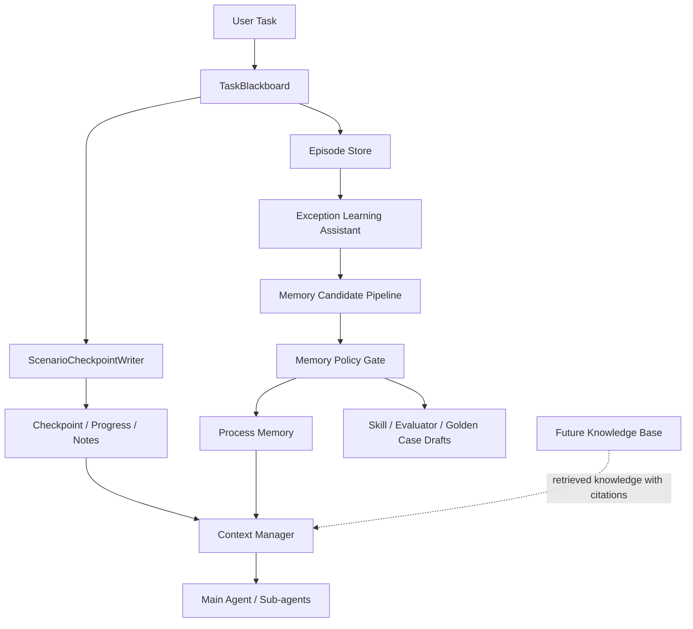

# PowerBanana Memory System Design

## Goal

PowerBanana needs a Memory System that supports enterprise business workflows without turning memory into an uncontrolled business knowledge store.

The current boundary is:

- Memory stores runtime continuity, process experience, and repeated exception candidates.
- Knowledge Base will later store industry knowledge, enterprise policies, domain references, and authoritative business facts.

This design is inspired by MiMo-Code's checkpoint, task progress, and memory maintenance patterns, but narrows them for PowerBanana's governed, scenario-based runtime.

## Non-Goal: Industry Knowledge Storage

PowerBanana Memory must not store:

- Industry regulations or professional knowledge.
- Contract clause interpretations.
- Enterprise policy documents.
- Authoritative metric definitions.
- Data dictionary ownership or long-term data semantics.
- Domain facts that should be cited from a Knowledge Base.

When future Knowledge Base support is added, Context Manager will combine:

- Memory: how the agent should continue work and improve the workflow.
- Knowledge Base: what business knowledge supports the answer.

Memory may store references to Knowledge Base results or tool evidence, but it must not become the source of truth for that knowledge.

## Design Principle

Memory has three jobs:

1. Task continuity: preserve where the current task, DAG, sub-agents, Human Gates, and EvaluationResults are.
2. Context recovery: rebuild useful context across compaction, long-running tasks, and resumed sessions.
3. Process improvement: detect repeated exceptions in fixed business workflows and ask whether they should become Skill, evaluator, golden case, or calibration case changes.

Memory must never override:

- Current tool evidence.
- TaskBlackboard artifacts.
- User confirmations.
- EvaluationResults.
- Human Gate decisions.
- Future Knowledge Base retrieval results.

## Current Implementation Baseline

The current code has only a minimal working-memory seed:

- `MemoryManager.write_task_summary()` writes one task summary record after report generation.
- The record lives inside the current `TaskBlackboard.memory_records`.
- It is not persisted to disk.
- It is not loaded at the beginning of a later task.
- It is not bounded, curated, searched, approved, or injected through Context Manager as a frozen memory snapshot.

Therefore the current implementation should be treated as a seed for the future Memory boundary, not as the final small-capacity memory system.

The first design milestone should be a small, scenario-local Process Memory snapshot, not full long-term memory.

## External Lessons Adopted

From MiMo-Code, PowerBanana should adopt:

- Dedicated checkpoint writing instead of ad hoc main-agent memory writes.
- Task progress files for long-running or resumed work.
- Path guards that enforce ownership of memory and checkpoint files.
- Draft-only learning passes that propose reusable assets from repeated work.

From Hermes Agent, PowerBanana should adopt:

- Small, bounded memory that stays high-signal.
- Session search adapted as structured Episode search.
- Skills as procedural memory, where repeatable procedures become Skill drafts rather than prose memory.
- Write approval for memory and Skill changes.
- Security scanning before memory is injected into prompts.

PowerBanana should not adopt:

- Free-form personal memory as a business decision input.
- Raw transcript search exposed directly to agents.
- Agent-managed Skill writes that become active automatically.
- External memory providers in the first implementation phase.
- Industry knowledge storage inside Memory.

## Architecture



TaskBlackboard remains the current-task fact source. Memory stores summaries, state, and improvement candidates around that fact source.

## Directory Shape

Memory is scenario-local by default:

```text
scenario_packs/
  <scenario_id>/
    memory/
      CHECKPOINT.md
      MEMORY.md
      notes.md
      tasks/
        <task_id>/
          progress.md
      episodes/
        <episode_id>.json
      candidates/
        <candidate_id>.json
      distill/
        skill_candidates/
        evaluator_candidates/
        golden_case_candidates/
        calibration_case_candidates/
```

`MEMORY.md` is a human-readable scenario process memory summary, not a domain knowledge file.

## Memory Types

| Type | Stores | Lifetime | Runtime Use |
|---|---|---|---|
| TaskBlackboard | Current task artifacts, tool results, traces, EvaluationResults | Task | Current-task fact source |
| Checkpoint | Intent, next action, DAG state, sub-agent state, gates | Task/session | Recovery |
| Task Progress | Per-task and per-sub-agent progress | Task/session | Recovery and audit |
| Notes | Temporary scratch notes | Task/session | Writer-owned scratch |
| Episode | Closed task summary, failure/fix summary, evaluation outcome summary | Short to medium | Similar task recovery and exception detection |
| Process Memory | Stable workflow preference or process lesson | Medium to long | Context hint only |
| Exception Candidate | Repeated special case in a fixed workflow | Until accepted/discarded | User confirmation |
| Distill Candidate | Draft Skill/evaluator/golden/calibration change | Until approved/discarded | Governance workflow only |

## Small-Capacity Process Memory

PowerBanana should start with a small-capacity, scenario-local process memory snapshot. This is the closest equivalent to Hermes-style bounded memory, but it is narrower and enterprise-governed.

File:

```text
scenario_packs/<scenario_id>/memory/MEMORY.md
```

Purpose:

- Keep the highest-signal workflow lessons for one scenario.
- Help the agent continue work consistently.
- Help the agent ask better exception-learning questions.
- Avoid repeatedly making the same process mistake.

It must not contain domain knowledge or business facts.

Suggested budget:

```yaml
process_memory_budget:
  max_chars: 2400
  max_items: 12
  max_item_chars: 240
  injection_mode: frozen_at_task_start
  refresh_policy: after_approved_memory_candidate
```

Suggested `MEMORY.md` sections:

```markdown
# Scenario Process Memory

## Workflow Hints
- Keep ranking reports concise and include metric value plus group label.

## Repeated Exceptions
- Users often clarify ambiguous "best channel" questions by choosing revenue or conversion rate.

## Reporting Preferences
- Prefer plain business wording over implementation details.

## Suppressed Patterns
- Do not ask about single-occurrence formatting preferences.
```

The snapshot is derived from structured records. It is not the source of truth. If the Markdown conflicts with structured records, TaskBlackboard, or EvaluationResults, the structured source wins.

## Structured Memory Records

The runtime should store structured records separately from the human-readable snapshot.

Example:

```json
{
  "memory_id": "mem_proc_001",
  "scenario_id": "sales_channel_analysis",
  "scope": "scenario",
  "memory_type": "process_lesson",
  "allowed_use": "report_format_hint",
  "content": {
    "summary": "Reports are clearer when metric ranking includes both value and row count."
  },
  "source_refs": ["episode_2026_06_11_001", "eval_result_003"],
  "confidence": 0.82,
  "status": "active",
  "created_at": "2026-06-11T10:00:00+08:00",
  "last_verified_at": "2026-06-11T10:00:00+08:00",
  "expires_at": "2026-09-11T10:00:00+08:00",
  "version": "0.1.0"
}
```

Required fields:

- `memory_id`
- `scenario_id`
- `scope`
- `memory_type`
- `allowed_use`
- `content.summary`
- `source_refs`
- `confidence`
- `status`
- `created_at`
- `version`

Allowed `memory_type` values in the first phase:

- `process_lesson`
- `reporting_preference`
- `workflow_recovery_hint`
- `repeated_exception_summary`
- `suppressed_pattern`

Rejected `memory_type` values:

- `industry_rule`
- `domain_fact`
- `policy_document`
- `contract_interpretation`
- `metric_definition`

Allowed `allowed_use` values:

- `resume_task`
- `workflow_hint`
- `report_format_hint`
- `exception_learning_prompt`
- `debugging_hint`

The Context Manager must reject records whose `allowed_use` does not match the current node purpose.

## ScenarioCheckpointWriter

`ScenarioCheckpointWriter` is the only writer for checkpoint-owned files:

- `memory/CHECKPOINT.md`
- `memory/notes.md`
- `memory/tasks/<task_id>/progress.md`

It records:

- Active user intent.
- Pinned Scenario Pack and Evaluation Contract versions.
- Current DAG node states.
- Running sub-agents and their progress.
- Pending Human Gates.
- Blocking EvaluationResults.
- Next concrete action.
- References to TaskBlackboard artifacts and replay snapshots.

It must not:

- Modify enabled `SCENARIO.md`, `EVALUATION.md`, or Skill files.
- Store industry knowledge.
- Create enabled rules, evaluators, or Skills.
- Treat memory as evidence for final business claims.

## MemoryPathGuard

All memory access goes through `MemoryPathGuard`.

It enforces:

- Every read and write is bound to a pinned `scenario_id`.
- A scenario cannot read another scenario's checkpoint, progress, episode, candidate, or process memory.
- Ordinary agents cannot write checkpoint-owned files.
- Memory candidates cannot write directly into active process memory.
- Draft Skill or evaluator changes are written only under scenario-local `distill/` or `changes/`.

This guard complements `ScenarioPathGuard`. `ScenarioPathGuard` protects scenario files generally; `MemoryPathGuard` protects memory-specific ownership and lifecycle rules.

## Episode Store

An episode is a structured closed-task summary.

It may include:

- Task goal.
- Scenario and version.
- DAG path executed.
- Skills used.
- Tool evidence refs.
- EvaluationResult summaries.
- Human Gate decisions.
- User corrections.
- Special cases encountered.
- Final outcome.

It must not include:

- Raw uploaded files.
- Full transcripts.
- Industry knowledge text copied from source documents.
- Sensitive values unless allowed by retention policy and redaction.

Example:

```json
{
  "episode_id": "episode_2026_06_11_001",
  "scenario_id": "contract_payment_review",
  "task_id": "task_001",
  "workflow_path": ["profile_document", "extract_contract_terms", "detect_payment_risk"],
  "special_cases": [
    {
      "case_type": "appendix_needed",
      "summary": "Main document lacked payment terms, but user pointed to appendix."
    }
  ],
  "evaluation_summary": {
    "gate_action": "human_review",
    "blocking_issues": ["missing_payment_terms"]
  },
  "user_corrections": [
    "Check appendix before marking payment terms missing."
  ]
}
```

## Exception Learning Assistant

PowerBanana business flows are relatively fixed. Therefore the learning loop should focus on repeated special cases inside those fixed flows, not on open-ended self-improvement.

Internally, this replaces the broad meaning of `ScenarioDream` and `ScenarioDistill`:

- `ScenarioDream` summarizes repeated exceptions and process signals from episodes.
- `ScenarioDistill` turns high-confidence repeated exceptions into user-facing improvement proposals.

User-facing names should be:

- Exception Learning Assistant.
- Skill Improvement Suggestions.
- Process Exception Suggestions.

## Repeated Exception Triggers

The system should not ask the user after every odd case. It should wait for repeated, meaningful signals.

Example policy:

```yaml
exception_learning_policy:
  min_occurrences: 3
  time_window_days: 30
  min_impact_level: medium
  require_human_confirmation_signal: true
  require_evaluation_signal: true
  auto_create_skill: false
  auto_modify_skill: false
```

Trigger signals include:

- The same Human Gate reason appears repeatedly.
- The same evaluator failure appears repeatedly.
- The user makes the same correction multiple times.
- The same Skill produces the same kind of incomplete output.
- The same DAG node repeatedly enters fallback.
- The same input shape repeatedly needs an extra step.

## User Confirmation Flow

When a repeated exception is detected, PowerBanana should ask in business language:

```text
In the last 30 days, this scenario saw 3 tasks where payment terms were
missing from the main document but later found in an appendix.

Should PowerBanana handle this as part of the workflow?

Options:
1. Add this behavior to the existing Skill.
2. Create a new local Skill for appendix checks.
3. Add a Human Gate rule only.
4. Add golden/calibration cases only.
5. Ignore this pattern for now.
```

The user response creates a draft. It does not change runtime behavior directly.

## Exception Candidate Record

```json
{
  "candidate_id": "exception_001",
  "scenario_id": "contract_payment_review",
  "type": "repeated_exception",
  "summary": "Payment terms were missing in the main document but found in an appendix in 3 recent tasks.",
  "occurrence_count": 3,
  "time_window_days": 30,
  "evidence_refs": [
    "episode_001",
    "episode_004",
    "episode_007"
  ],
  "impacted_skill": "local:extract_contract_terms@0.1.0",
  "suggested_actions": [
    "modify_existing_skill",
    "add_calibration_case"
  ],
  "status": "pending_user_decision"
}
```

## Candidate State Machines

Exception candidates have a separate lifecycle from active memory and active Skills.

```text
observed
-> candidate_created
-> threshold_met
-> pending_user_decision
-> user_selected_action
-> draft_created
-> lint_passed
-> tests_passed
-> approved
-> activated
```

Terminal states:

- `ignored`
- `rejected`
- `suppressed`
- `expired`
- `superseded`

Rules:

- `observed` can be created from one event, but it cannot prompt the user.
- `threshold_met` requires the exception learning policy to pass.
- `pending_user_decision` is the first user-facing state.
- `draft_created` still has no runtime effect.
- `activated` requires approval and version publication.
- Suppressed patterns must record who suppressed them and when to ask again, if ever.

Process memory records have a simpler lifecycle:

```text
candidate
-> validated
-> active
-> stale
-> expired
```

Only `active` process memory can be considered by Context Manager, and even then only as a hint.

## Candidate Actions

PowerBanana can propose:

- Modify an existing scenario-local Skill.
- Create a new scenario-local Skill.
- Add a Human Gate rule.
- Add or adjust an evaluator.
- Add golden cases.
- Add calibration cases.
- Ignore or suppress the pattern.

It must not:

- Automatically modify a Skill.
- Automatically create an enabled Skill.
- Promote a local Skill to global.
- Store the exception as industry knowledge.
- Treat repeated user corrections as authoritative domain policy without approval.

## Skill Change Lifecycle

When the user chooses to modify or create a Skill:

```text
user confirms exception candidate
-> create Skill change draft
-> generate paired evaluator or golden/calibration case drafts when needed
-> lint Skill manifest and Scenario Pack
-> run affected golden and calibration cases
-> request domain-owner or administrator approval
-> publish new local Skill version or discard draft
```

Existing Skill example:

```text
local:extract_contract_terms@0.1.0
-> draft change
-> local:extract_contract_terms@0.2.0
```

New Skill example:

```text
local:check_contract_appendix@0.1.0
```

New Skills are scenario-local by default. Promotion to global requires separate multi-scenario evidence, review, tests, versioning, and approval.

## Context Manager Rules

Memory enters prompts only through Context Manager.

Context Manager may inject:

- Checkpoint state needed for continuation.
- Task progress summaries.
- Process Memory relevant to report format or workflow behavior.
- Exception candidates when asking the user for confirmation.

Context Manager must not inject:

- Raw episode transcripts.
- Unapproved exception candidates as instructions.
- Distill drafts as active rules.
- Memory items with `allowed_use` incompatible with the current node.
- Any memory item that conflicts with current TaskBlackboard evidence or EvaluationResults.

## Context Injection Policy

Memory injection should be bounded and purpose-specific.

Suggested budgets:

```yaml
context_memory_budget:
  checkpoint_tokens: 700
  task_progress_tokens: 500
  process_memory_tokens: 500
  exception_prompt_tokens: 500
  episode_search_tokens: 800
```

Injection rules:

- Checkpoint and task progress may be injected when resuming or continuing a long task.
- Process Memory may be injected at task start as a frozen scenario snapshot.
- Exception candidates may be injected only when the system is asking the user for a decision.
- Episode summaries are retrieved on demand; they are not injected by default.
- Distill drafts are never injected as instructions for normal task execution.

If token budget is exceeded, the priority order is:

1. Current TaskBlackboard state.
2. Blocking EvaluationResults and Human Gates.
3. Checkpoint next action.
4. Task progress summary.
5. Active Process Memory.
6. Episode search results.
7. Exception candidates for user confirmation.

## Memory Safety

Because memory can enter prompts, every memory item must be treated as potentially unsafe until validated.

Validation should check:

- Prompt-injection phrases.
- Credential exfiltration requests.
- Hidden or bidirectional Unicode characters.
- Unsupported `memory_type`.
- Unsupported `allowed_use`.
- Missing source refs.
- Sensitive values that violate retention policy.
- Business knowledge content that belongs in Knowledge Base.

Unsafe items are rejected or quarantined as candidates. They are not injected into Context Manager output.

Memory conflict rules:

- Current TaskBlackboard evidence beats memory.
- Current EvaluationResults beat memory.
- Human Gate decisions beat memory.
- Future Knowledge Base retrievals beat memory for domain facts.
- Newer approved process memory beats older process memory only when it supersedes the old record explicitly.

## Phased Rollout

Phase 0: current baseline

- `MemoryManager.write_task_summary()` writes a minimal task summary to the in-memory TaskBlackboard.
- No persistent small-capacity memory.
- No checkpoint files.
- No Episode Store.
- No MemoryPathGuard.

Phase 1:

- Scenario-local checkpoints.
- Task progress.
- Notes.
- Episode summaries.
- MemoryPathGuard.
- No long-term automatic writes.
- Small-capacity scenario `MEMORY.md` generated from approved process memory.

Phase 2:

- Exception Learning Assistant.
- Exception Candidate records.
- Process Memory with strict `allowed_use`.
- Draft-only Skill, evaluator, golden case, and calibration case suggestions.

Phase 3:

- Knowledge Base integration.
- Context Manager combines Memory and retrieved knowledge.
- Memory remains process-oriented; Knowledge Base becomes the source for domain knowledge.

## Testing

Tests should cover:

- Rejection of cross-scenario memory reads.
- Rejection of ordinary-agent writes to checkpoint-owned files.
- Checkpoint reconstruction from `CHECKPOINT.md` and task progress.
- Episode creation without raw source document leakage.
- Small-capacity `MEMORY.md` budget enforcement.
- Process Memory schema validation.
- Rejection of unsupported `memory_type` and `allowed_use`.
- Rejection or quarantine of prompt-injection-like memory content.
- Exception candidate creation only after threshold triggers.
- No suggestion when repeated signal is below threshold.
- Suppression state preventing repeated prompts for ignored patterns.
- User confirmation creates a draft, not an enabled Skill.
- Existing Skill modification creates a versioned draft.
- New Skill proposal stays scenario-local.
- Distill drafts cannot affect runtime until linting, tests, and approval pass.
- Context Manager refuses to inject unapproved candidates as instructions.
- Context Manager respects memory token budgets and priority order.
- Memory does not override TaskBlackboard, EvaluationResult, Human Gate, or Knowledge Base evidence.

## Success Criteria

The Memory System is successful when PowerBanana can resume long-running scenario tasks, explain task progress, and detect repeated special cases in fixed business workflows without storing industry knowledge or changing Skills automatically.

The agent may ask the user whether a repeated exception should become a Skill or evaluator improvement, but runtime behavior changes only after draft generation, linting, regression checks, and approval.
