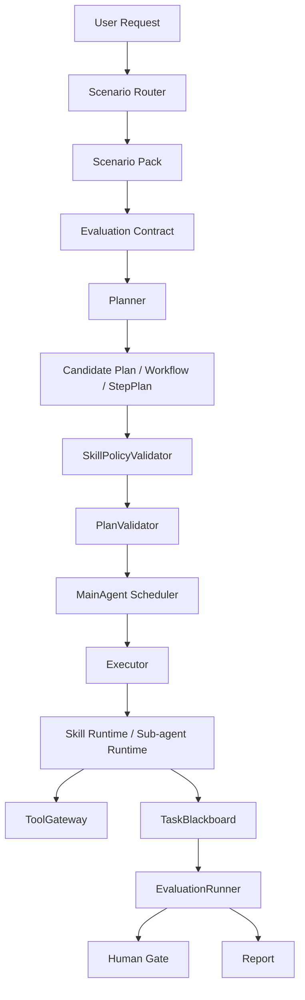

# Skill-Governed Runtime Design

## Goal

PowerBanana should evolve from a fixed Phase 1 data-analysis workflow into a more open governed-agent runtime. The core runtime should stay responsible for hard safety and audit boundaries, while business scenarios should be extended through versioned Skills and Scenario Packs.

The intended direction is:

- Framework = governance kernel.
- Skill = governed capability plus constraints.
- Scenario Pack = business scenario assembled from Skills, routing rules, evaluators, and golden cases.

This keeps the system adaptable to different domains without turning Skills into unbounded prompts or allowing scenario code to bypass governance.

## Current Constraint

PowerBanana currently has a fixed golden path:

```text
planner -> plan validation -> data_profile_agent -> data_analysis_agent -> report_agent
```

This is appropriate for v0.1 because it validates the AgentX v0.3 governance model on one small data-analysis path. However, the fixed path makes new scenarios expensive. Adding a contract-review, sales-ops, finance-review, or customer-service scenario would currently require code changes across planner routing, sub-agent selection, step construction, evaluation, and tests.

## Design Principle

Use Skills to make business behavior configurable, but keep non-negotiable governance inside the framework.

Skills may declare:

- What capability they provide.
- What input and output schemas they require.
- Which tools they may call.
- What context they are allowed to read.
- What risk level they carry.
- Which evaluators must pass.
- Which Human Gates are required.
- What golden cases protect their behavior.

Skills must not decide:

- Whether they can bypass ToolGateway.
- Whether they can skip PlanValidator.
- Whether their own output is accepted as final without evaluation.
- Whether high-risk writes can avoid Human Gate.
- Whether they can read full Blackboard or Memory directly.

## Runtime Architecture



The framework owns routing, validation, execution, blackboard writes, tool mediation, evaluation aggregation, human gates, and final reporting. Scenario Packs and Skills provide declarative capabilities and constraints.

## Main Agent Scheduler

The Main Agent should be a deterministic scheduler, not a free-running executor. It may use a Planner to produce candidate DAGs and Skill chains, but only the scheduler advances frozen work.

Scheduler responsibilities:

- Maintain task, DAG node, workflow node, and Skill step state.
- Compute ready nodes from the frozen Task DAG.
- Dispatch only nodes whose dependencies, context permissions, tool policy, budget, and Human Gate state allow execution.
- Enforce Scenario Pack concurrency limits.
- Track running work, retries, timeouts, skips, and failures.
- Write dispatch decisions and node transitions to TaskBlackboard.
- Trigger EvaluationRunner after node or fan-in completion.
- Route blocked or risky nodes to Human Gate.
- Hand only evaluated artifacts to report generation.

The scheduler must not:

- Invent new Skills after validation.
- Execute a Skill that was not present in the frozen plan.
- Let sub-agents call each other directly.
- Let a node read unevaluated upstream artifacts unless the Scenario Pack explicitly allows candidate-only reads.
- Treat Skill output as trusted before Blackboard recording and evaluation.

This makes the Main Agent powerful enough to coordinate many agents while keeping it predictable and auditable.

## Parallel Execution Model

Parallelism should be DAG-driven. The scheduler can run multiple nodes from the same ready layer when all of these are true:

1. The nodes have no unmet dependencies.
2. Their required input refs are available in TaskBlackboard.
3. Their Scenario Pack allows parallel execution.
4. Their Skill manifests allow concurrent execution.
5. ToolGateway rate limits and risk policy allow the tool calls.
6. Human Gate is not pending for a required upstream decision.
7. The target artifacts do not conflict, or a merge policy is declared.

Example parallel shape:

```text
profile_document
  -> extract_payment_terms
  -> detect_compliance_risk
  -> detect_confidentiality_risk
  -> aggregate_risk_report
```

After `profile_document` succeeds, the three risk Skills can run in parallel if the scenario policy allows it. `aggregate_risk_report` is a fan-in node and can run only after the required upstream nodes finish and their outputs pass evaluation or are explicitly marked as candidate artifacts.

## Concurrency Policy

Concurrency policy belongs to the Scenario Pack and is enforced by the scheduler. A low-risk read-only analysis scenario can allow more parallelism than a high-risk write or external-action scenario.

Example:

```yaml
concurrency_policy:
  max_parallel_sub_agents: 4
  max_parallel_skill_steps: 4
  max_parallel_tool_calls: 2
  max_parallel_high_risk_nodes: 0
  allow_parallel_candidate_reads: false
  on_tool_rate_limit: retry_with_backoff
```

The default policy should be conservative:

- One task chain runs linearly unless the Scenario Pack opts into parallel layers.
- Read-only, low-risk Skills may be parallelized.
- LLM-backed Skills default to sequential execution unless deterministic aggregation is defined.
- Write actions and external side effects are never parallelized in Phase 1.
- A Human Gate blocks dependent nodes but does not need to block unrelated independent nodes unless scenario policy requires a full pause.

## Blackboard Merge And Fan-in

Parallel execution only works if Blackboard writes and fan-in are explicit.

Each parallel node should write unique artifact refs by default:

```text
blackboard://task_001/artifacts/payment_terms_v1
blackboard://task_001/artifacts/compliance_risk_v1
blackboard://task_001/artifacts/confidentiality_risk_v1
```

If multiple nodes may write related claims or the same logical artifact, the Scenario Pack must declare a merge policy:

```yaml
merge_policy:
  artifact_conflict: require_human_review
  claim_conflict: create_conflict_entry
  duplicate_claim: keep_highest_confidence_with_trace
  fan_in_requires:
    - all_required_nodes_completed
    - no_blocking_evaluations
    - no_unresolved_conflicts
```

Fan-in nodes read only from Blackboard refs, not from direct sub-agent messages. They must check:

- Required upstream nodes completed, skipped with allowed degradation, or failed with allowed fallback.
- Required upstream evaluations passed or returned an allowed partial result.
- No blocking security finding exists.
- Conflicts are resolved or explicitly surfaced to Human Gate.
- Artifact versions match the expected refs.

This makes parallelism safe enough for multi-agent workflows instead of turning it into uncontrolled message passing.

## Skill Manifest

Each Skill should be represented by a manifest plus an implementation handler.

Example shape:

```yaml
skill_id: compute_grouped_metric
version: 0.2.0
capability_tags:
  - data_analysis
  - metric_computation
risk_level: low
input_schema: Rows,AnalysisRequest
output_schema: MetricResult
allowed_tools:
  - dataset.read_snapshot
context_policy:
  allowed_refs:
    - dataset://current
    - blackboard://current/artifacts/data_profile
  trust_rules:
    dataset://current: data_only
required_evaluators:
  - schema_evaluator
  - metric_recompute_evaluator
  - evidence_coverage_evaluator
human_gate:
  required: false
idempotency:
  key_fields:
    - task_id
    - dataset_version
    - skill_id
    - input_hash
golden_cases:
  - evals/golden_cases/conversion_rate_basic.json
```

The manifest is not an execution permission by itself. It is an input to validation. The runtime still decides whether a requested Skill can run in the current scenario, autonomy level, tool policy, and risk context.

## Scenario Pack

A Scenario Pack should assemble a business scenario without changing the core runtime.

It should contain:

- Scenario identity and routing terms.
- Allowed Skills and Skill versions.
- Optional default Task DAG or Workflow DAG template.
- Concurrency policy.
- Merge and fan-in policy.
- Planner rules or planner adapter.
- Context policy.
- Evaluation Pack or Evaluation Contract reference.
- Human Gate policy.
- Tool policy.
- Golden cases and calibration cases.

Example:

```yaml
scenario_id: sales_channel_analysis
route_terms:
  - channel
  - conversion rate
  - revenue
allowed_skills:
  - profile_dataset@0.1.0
  - compute_grouped_metric@0.2.0
  - rank_metric_values@0.1.0
  - summarize_metric_report@0.1.0
default_flow:
  - profile_dataset
  - compute_grouped_metric
  - rank_metric_values
  - summarize_metric_report
concurrency_policy:
  max_parallel_sub_agents: 1
  max_parallel_skill_steps: 1
  max_parallel_tool_calls: 1
merge_policy:
  artifact_conflict: block
  fan_in_requires:
    - all_required_nodes_completed
    - no_blocking_evaluations
evaluation_policy:
  required:
    - planner_intent_evaluator
    - metric_recompute_evaluator
    - context_security_evaluator
```

## Scenario And Evaluation Pack Pairing

A Scenario Pack must be paired with an Evaluation Pack before it can be enabled. The Scenario Pack defines how the business workflow may run. The Evaluation Pack defines how the workflow is judged as correct, safe, partial, blocked, or requiring human review.

Recommended directory shape:

```text
scenario_packs/
  contract_payment_review/
    SCENARIO.md
    EVALUATION.md
    golden_cases/
      valid_payment_review.json
      missing_payment_terms.json
    calibration_cases/
      long_payment_period_should_human_review.json
      claim_without_evidence_should_block.json
```

`SCENARIO.md` owns:

- Scenario identity and purpose.
- Input types.
- Routing terms.
- Allowed Skills and versions.
- Default Task DAG or Workflow DAG.
- Tool policy.
- Concurrency policy.
- Merge and fan-in policy.
- Human Gate categories.

`EVALUATION.md` owns:

- Baseline evaluators that cannot be disabled.
- Skill-level evaluator requirements.
- Scenario-level business rules.
- Fan-in evaluator requirements.
- Report-level evaluator requirements.
- Gate mapping for `pass`, `pass_with_warning`, `return_partial`, `needs_clarification`, `human_review`, and `block`.
- Golden case and calibration case requirements.

The runtime should compile both files into an Evaluation Contract. The contract is the machine-checked binding between a scenario, its Skills, its expected artifacts, its evaluators, and its gate rules.

Example:

```yaml
evaluation_contract:
  scenario_id: contract_payment_review
  version: 0.1.0
  required_baseline_evaluators:
    - schema_evaluator@0.1.0
    - evidence_coverage_evaluator@0.1.0
    - context_security_evaluator@0.1.0
  required_domain_evaluators:
    - contract_payment_rule_evaluator@0.1.0
  skill_output_checks:
    extract_contract_terms@0.1.0:
      output_schema: ContractTerms
      required_evaluators:
        - schema_evaluator@0.1.0
        - evidence_coverage_evaluator@0.1.0
    detect_payment_risk@0.1.0:
      output_schema: PaymentRiskFinding
      required_evaluators:
        - contract_payment_rule_evaluator@0.1.0
        - risk_severity_evaluator@0.1.0
  gate_rules:
    - id: missing_payment_terms
      condition: payment_terms.not_found
      gate_action: human_review
    - id: claim_without_evidence
      condition: report.claims_without_evidence > 0
      gate_action: block
    - id: payment_days_over_60
      condition: payment_days > 60
      gate_action: human_review
```

No Scenario Pack may move from `draft` to `enabled` without a valid Evaluation Contract.

## Agent Initialization Flow

Scenario and Evaluation Pack generation should run during Agent initialization, not during every task. The runtime should distinguish setup-time configuration from task-time execution.

Initialization should run when:

- The Agent starts for the first time and has no enabled Scenario Pack.
- An administrator creates a new business scenario.
- A domain owner explicitly asks to add a new scenario.
- A deployment imports a Scenario Pack that has not been linted or approved in this environment.

Initialization flow:

```text
agent starts
-> load enabled Scenario Packs
-> if none exist, start Scenario Builder
-> collect scenario requirements through guided questions
-> collect evaluation requirements through guided questions
-> generate SCENARIO.md draft
-> generate EVALUATION.md draft
-> lint Scenario Pack
-> lint Evaluation Pack
-> compile Evaluation Contract
-> generate golden and calibration drafts
-> request domain-owner or administrator approval
-> enable approved pack and pin active version
```

After initialization, normal user tasks do not regenerate Scenario Packs or Evaluation Contracts. They load the active, enabled versions and run through routing, planning, validation, scheduling, Blackboard, EvaluationRunner, and Human Gate.

## Rule Maintenance Flow

Users should be able to add or modify rules after initialization, but changes must be versioned and governed. An enabled Scenario Pack should not be edited in place.

Rule changes should start from user-friendly requests such as:

- Add a new high-risk condition.
- Change a threshold.
- Require an extra evidence field.
- Add a new output section.
- Add a new human review trigger.
- Add a new golden or calibration example.

Rule maintenance flow:

```text
user requests rule change
-> builder asks follow-up questions
-> create change request
-> generate new draft version of SCENARIO.md and/or EVALUATION.md
-> show human-readable diff
-> run Scenario Pack lint
-> run Evaluation Policy lint
-> compile new Evaluation Contract
-> run affected golden and calibration cases
-> request approval
-> activate new version or keep existing version
```

Versioning rules:

- Enabled packs are immutable.
- Rule changes create a new draft version, such as `contract_payment_review@0.2.0`.
- Running tasks stay pinned to the Scenario Pack and Evaluation Contract version they started with.
- New tasks use the newly active version only after approval.
- Rollback switches the active pointer back to a previous approved version.
- Every rule change writes an audit record with the requester, reviewer, diff, test results, and activation time.

The LLM may help collect the change, explain the diff, and suggest affected tests. It must not directly activate the change or bypass linting, calibration, approval, or version pinning.

## User-Friendly Evaluation Builder

Non-technical users should not write evaluator code or gate rules directly. A Scenario Pack Builder can use an LLM conversation to collect evaluation requirements and generate an Evaluation Pack draft.

The builder should ask questions such as:

1. What does a good final answer need to contain?
2. Which mistakes are unacceptable?
3. Which conclusions require evidence or source references?
4. Which cases should return a partial result instead of a full answer?
5. Which cases must ask for clarification?
6. Which cases must go to human review?
7. Can you provide one good example and one bad example?
8. What risk levels or business thresholds matter?

The LLM may generate:

- `EVALUATION.md` draft.
- Structured Evaluation Contract draft.
- Golden case drafts.
- Calibration case drafts.
- Plain-language explanations of linter failures.

The LLM must not:

- Disable baseline evaluators.
- Mark a high-risk rule as automatically passing.
- Enable an unregistered evaluator.
- Approve its own Evaluation Pack.
- Bypass calibration cases.
- Treat natural-language evaluation prose as executable policy.

Execution uses only structured frontmatter and YAML blocks that pass linting. Natural-language sections explain intent but do not become runtime rules.

## Evaluation Layering

Evaluation should be layered so every Scenario Pack gets common safety checks and domain-specific checks.

| Layer | Purpose | User configurable |
|---|---|---|
| Baseline Evaluation | Schema, evidence, context safety, dataset or source version, ToolGateway boundary | No |
| Skill Evaluation | Whether each Skill output matches its schema and evidence requirements | Limited by Skill manifest |
| Scenario Evaluation | Domain-specific business rules and thresholds | Yes, through builder and approval |
| Fan-in Evaluation | Whether parallel outputs can be safely merged | Yes, through merge policy |
| Report Evaluation | Whether the final user-facing answer is complete, supported, and safe | Yes, with required baseline checks |

Each layer writes an EvaluationResult to TaskBlackboard. The scheduler uses the strongest gate action when deciding whether to continue, retry, ask for clarification, route to human review, return partial output, or block.

## Scenario Enablement Lifecycle

Scenario Pack status should follow this lifecycle:

```text
draft
-> scenario_lint_passed
-> evaluation_lint_passed
-> calibration_ready
-> approved
-> enabled
```

Enablement requirements:

- `SCENARIO.md` exists and passes Scenario Pack linting.
- `EVALUATION.md` exists and passes Evaluation Policy linting.
- Every Skill output has an evaluator or an explicit human review path.
- Every high-risk rule has a Human Gate.
- Every fan-in node has merge and fan-in evaluation rules.
- At least one positive golden case exists.
- At least one negative or escalation calibration case exists.
- An administrator or domain owner approves the pack.

## Validation Flow

The Planner may choose Skills, but it only creates candidates. Before execution, the framework must validate:

1. The selected Scenario Pack exists and is enabled.
2. The selected Scenario Pack has a valid paired Evaluation Contract.
3. Every Skill exists, is versioned, and is allowed by the Scenario Pack.
4. Each Skill input can be satisfied by prior outputs, user input, or allowed ToolGateway results.
5. Tool permissions match the Skill manifest and scenario policy.
6. Context references are limited to authorized Blackboard, Memory, and dataset views.
7. Required baseline, Skill-level, scenario-level, fan-in, and report evaluators are present and versioned.
8. Human Gate requirements are attached for risky operations.
9. DAG and Step Plan topology is acyclic and bounded.
10. Autonomy Policy allows the proposed number of steps, alternatives, retries, and parallelism.
11. Concurrency Policy allows every parallel-ready layer.
12. Merge Policy covers any fan-in node or shared logical artifact.
13. Golden and calibration case requirements are satisfied for enabled scenarios.

Only a passing candidate becomes a frozen executable plan.

## Constraint Model

Constraints should be split into two layers.

Framework hard constraints:

- All tools go through ToolGateway.
- All executable plans go through PlanValidator.
- All Skill calls are scheduled by the MainAgent Scheduler and Executor.
- All outputs that matter are written to TaskBlackboard.
- Final answers require EvaluationRunner aggregation.
- Enabled scenarios require a valid paired Evaluation Contract.
- Writes and high-risk actions require Human Gate.
- Raw user content remains untrusted unless transformed by verified tools.
- Parallel nodes cannot read each other's private state or direct messages.
- Fan-in nodes can read only authorized Blackboard refs and evaluation results.

Skill-declared constraints:

- Required input fields.
- Output schema.
- Allowed low-level tools.
- Context visibility and trust labels.
- Risk level.
- Evaluator requirements.
- Human Gate triggers.
- Concurrency constraints.
- Merge and fan-in requirements.
- Evaluation policy references.
- Golden and calibration requirements.

This split keeps the platform open to new scenarios while preserving safety boundaries.

## Multi-Industry Fit Assessment

This architecture is a reasonable foundation for a multi-industry business-agent platform because it separates stable governance from scenario-specific behavior.

The reusable platform layer is:

- Scenario routing.
- Deterministic scheduling.
- Plan and Skill policy validation.
- ToolGateway mediation.
- TaskBlackboard state, evidence, and audit records.
- Evaluation aggregation.
- Human Gate handling.
- Report assembly from evaluated artifacts.

The industry-specific layer is:

- Scenario Pack.
- Domain vocabulary and routing rules.
- Domain Skills.
- Domain tool bindings.
- Domain evaluators.
- Domain Human Gate policy.
- Golden cases and calibration cases.

This separation lets the same runtime support sales analysis, contract review, finance review, customer-service triage, compliance checks, and internal knowledge workflows without rewriting the scheduler or governance core.

## Suitable Scenario Types

The architecture is best suited to scenarios where the work can be represented as a governed DAG of evidence-producing steps.

Good early candidates:

- Sales and operations analysis.
- CSV, spreadsheet, and report analysis.
- Contract review and clause-risk extraction.
- Finance document review and rule checking.
- Customer-service ticket classification and response drafting.
- Internal knowledge retrieval followed by structured reporting.
- Compliance and quality review workflows.

These scenarios share useful traits: inputs can be snapshotted, intermediate artifacts can be written to Blackboard, outputs can be evaluated, and high-risk actions can be routed to Human Gate.

## Less Suitable Initial Scenarios

The architecture should not start with scenarios where the primary value depends on unrestricted autonomy, high-frequency side effects, or hard real-time decisions.

Poor initial candidates:

- Fully autonomous production-system operators.
- High-frequency trading or real-time fraud blocking.
- Irreversible write actions without human approval.
- Open-ended internet agents with broad tool access.
- High-liability legal, medical, or financial final decisions without expert review.
- Long chains of cross-system writes where rollback and idempotency are not mature.

These scenarios may become possible later, but only after ToolGateway permissions, Human Gate workflows, replay, compensation, and tenant-level access control are production-grade.

## Key Design Risks

The architecture is sound, but its multi-industry usefulness depends on controlling a few risks.

Scenario Pack complexity:

- Scenario Packs can become too large if routing, workflow, tool policy, evaluator policy, and tests are not schema-validated.
- Mitigation: define a strict Scenario Pack schema and linter before adding many scenarios.

Skill granularity:

- Skills that are too broad become opaque scenario-specific mini-agents.
- Skills that are too small create brittle plans and excessive scheduler overhead.
- Mitigation: define Skills around independently testable business capabilities with clear input and output schemas.

Evaluator coverage:

- Multi-industry agents fail when they can execute but cannot verify domain correctness.
- Mitigation: every production Skill needs at least schema checks, evidence checks, and one domain-specific evaluator or human review path.

Permission and data isolation:

- Multi-industry use will introduce departments, tenants, data classes, and tool credentials.
- Mitigation: keep credentials out of Skills, enforce all tool access through ToolGateway, and add tenant and role policy before production multi-tenant deployment.

Parallel fan-in:

- Parallel agents may produce conflicting claims or partially evaluated artifacts.
- Mitigation: require merge policy, conflict entries, artifact versions, and fan-in evaluators before enabling broad parallelism.

## Production Readiness Requirements

Before treating this as a production multi-industry platform, the following components should exist:

1. Scenario Pack schema and linter.
2. Skill manifest schema and SkillPolicyValidator.
3. MainAgent Scheduler with ready-node dispatch, state transitions, retries, timeouts, and Human Gate blocking.
4. Blackboard persistence with artifact versioning, conflict entries, and replay snapshots.
5. Evaluation registry with domain-specific evaluator contracts.
6. Golden and calibration case runners per Scenario Pack.
7. ToolGateway policy with deny-by-default authorization.
8. Tenant, role, data-classification, and credential-isolation model.
9. Observability for scheduler transitions, tool calls, evaluation outcomes, and human gates.
10. Release and rollback process for Scenario Packs and Skill versions.

For near-term implementation, the first three platform investments should be Scenario Pack schema/linting, Skill manifests with policy validation, and the deterministic MainAgent Scheduler.

## Migration Plan

PowerBanana should migrate incrementally.

1. Introduce a Skill manifest model next to the existing `SkillDefinition`.
2. Bind existing `compute_grouped_metric` and `rank_metric_values` Skills to manifests.
3. Add `SkillPolicyValidator` and run it before Step Plan execution.
4. Move hardcoded metric requirements into Skill and analysis vocabulary metadata.
5. Introduce a minimal `sales_channel_analysis` Scenario Pack for the existing path.
6. Add a Scenario Pack schema and linter before creating additional industry packs.
7. Add an Evaluation Pack schema, Evaluation Contract compiler, and EvaluationPolicyLinter.
8. Create an `EVALUATION.md` for `sales_channel_analysis` and pair it with the first Scenario Pack.
9. Let the Planner select the Scenario Pack and Skill chain, while preserving the current fixed fallback.
10. Introduce a scheduler state model for `pending`, `ready`, `running`, `succeeded`, `failed`, `skipped`, `blocked`, and `needs_human_gate`.
11. Replace the linear TaskDagExecutor loop with ready-node scheduling while keeping default concurrency at 1.
12. Add Scenario Pack `concurrency_policy` and enforce it before dispatch.
13. Add merge and fan-in validation for aggregate nodes.
14. Enable parallel execution first for low-risk read-only Skills.
15. Add one non-data-analysis Scenario Pack, such as contract review or ticket triage, to validate cross-industry reuse.
16. Add first-run Agent initialization that launches the Scenario and Evaluation builders when no enabled Scenario Pack exists.
17. Add rule maintenance change requests that create new draft pack versions instead of editing enabled packs in place.
18. Add one user-friendly builder path that collects both scenario requirements and evaluation requirements through guided questions.
19. Expand golden cases to assert selected Skills, required evaluators, scheduler transitions, and policy gates.

This path avoids a large rewrite. The existing fixed workflow becomes the first Scenario Pack.

## Testing

Tests should cover:

- Skill manifest parsing and validation.
- Scenario Pack schema and lint validation.
- Evaluation Pack schema and lint validation.
- Evaluation Contract compilation from `SCENARIO.md` and `EVALUATION.md`.
- Rejection of enabled Scenario Packs without a paired Evaluation Contract.
- Rejection of unknown or disabled Skills.
- Rejection of Skills that request unauthorized tools.
- Rejection of missing required evaluators.
- Rejection of high-risk Skills without Human Gate.
- Rejection of parallel nodes when Scenario Pack concurrency does not allow them.
- Rejection of fan-in nodes without an explicit merge policy.
- Rejection of fan-in nodes without fan-in evaluator coverage.
- Scheduler tests for ready-node selection, dependency blocking, retry limits, timeout handling, and Human Gate blocking.
- Blackboard tests for parallel artifact version conflicts and conflict entry creation.
- Successful execution of the current metric-analysis flow through the new manifest path.
- Successful execution of at least one non-data-analysis Scenario Pack through the same runtime interfaces.
- Builder tests that turn user-friendly quality criteria into draft evaluation rules without enabling them automatically.
- First-run initialization tests for the no-enabled-pack state.
- Runtime tests that skip builders and load only active enabled versions.
- Rule maintenance tests that create new draft versions, show diffs, rerun affected golden and calibration cases, and require approval before activation.
- Version pinning tests proving running tasks keep their original Scenario Pack and Evaluation Contract versions.
- Golden cases that verify selected Scenario Pack, Skill chain, scheduler trace, evaluation gates, and final answer.

## Non-Goals

This design does not introduce:

- Free-form LLM planning.
- Arbitrary plugin execution.
- Direct Skill access to credentials, raw full Blackboard, or full Memory.
- Write-back tools in Phase 1.
- Multi-tenant permission enforcement.
- Distributed worker infrastructure.
- Unbounded autonomous loops.

Those can be added later only through the same ToolGateway, Policy, Evaluation, and Human Gate boundaries.

## Success Criteria

The design is successful when a new low-risk scenario can be added mostly by introducing a Scenario Pack, Skill manifests, focused handlers, concurrency and merge policies, and tests, without changing the core runtime orchestration loop.

The scheduler should be able to execute a frozen DAG with at least one parallel ready layer, record deterministic node transitions, block unsafe fan-in, and preserve the current single-chain PowerBanana behavior when concurrency limits are set to 1.

The multi-industry abstraction should be considered validated only after at least two meaningfully different Scenario Packs run through the same scheduler, Blackboard, ToolGateway, EvaluationRunner, and Human Gate interfaces without changing the core orchestration loop.

Every enabled Scenario Pack must have a paired Evaluation Contract that covers baseline checks, Skill outputs, scenario rules, fan-in behavior, report quality, golden cases, and calibration cases. A Scenario Pack without this pairing remains `draft` or `scenario_lint_passed`, never `enabled`.

Scenario and Evaluation builders should run during initialization or explicit rule-maintenance flows only. Normal task execution should use pinned, enabled Scenario Pack and Evaluation Contract versions without regenerating configuration.

The framework should become more open, but the acceptance rule remains strict: no Skill result becomes trusted merely because a Skill produced it. It becomes trusted only after the framework records, evaluates, and gates it.
