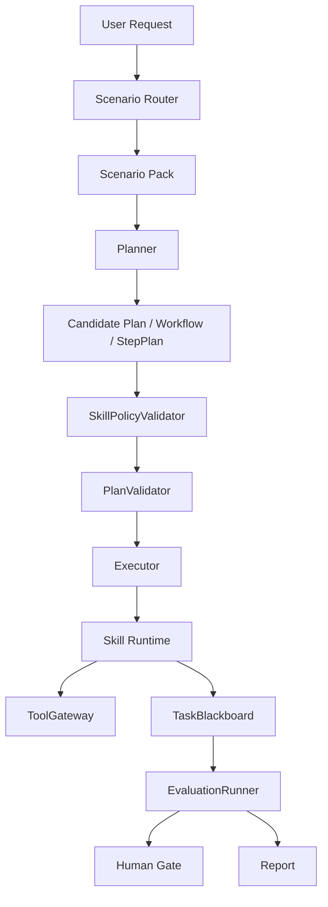

# Skill-Governed Runtime Design

## Goal

PowerBanana should evolve from a fixed Phase 1 data-analysis workflow into a more open governed-agent runtime. The core runtime should stay responsible for hard safety and audit boundaries, while business scenarios should be extended through versioned Skills and Scenario Packs.

The intended direction is:

- Framework = governance kernel.
- Skill = governed capability plus constraints.
- Scenario Pack = business scenario assembled from Skills, routing rules, evaluators, and golden cases.

This keeps the system adaptable to different domains without turning Skills into unbounded prompts or allowing scenario code to bypass governance.

## Current Constraint

PowerBanana currently has a fixed golden path:

```text
planner -> plan validation -> data_profile_agent -> data_analysis_agent -> report_agent
```

This is appropriate for v0.1 because it validates the AgentX v0.3 governance model on one small data-analysis path. However, the fixed path makes new scenarios expensive. Adding a contract-review, sales-ops, finance-review, or customer-service scenario would currently require code changes across planner routing, sub-agent selection, step construction, evaluation, and tests.

## Design Principle

Use Skills to make business behavior configurable, but keep non-negotiable governance inside the framework.

Skills may declare:

- What capability they provide.
- What input and output schemas they require.
- Which tools they may call.
- What context they are allowed to read.
- What risk level they carry.
- Which evaluators must pass.
- Which Human Gates are required.
- What golden cases protect their behavior.

Skills must not decide:

- Whether they can bypass ToolGateway.
- Whether they can skip PlanValidator.
- Whether their own output is accepted as final without evaluation.
- Whether high-risk writes can avoid Human Gate.
- Whether they can read full Blackboard or Memory directly.

## Runtime Architecture



The framework owns routing, validation, execution, blackboard writes, tool mediation, evaluation aggregation, human gates, and final reporting. Scenario Packs and Skills provide declarative capabilities and constraints.

## Skill Manifest

Each Skill should be represented by a manifest plus an implementation handler.

Example shape:

```yaml
skill_id: compute_grouped_metric
version: 0.2.0
capability_tags:
  - data_analysis
  - metric_computation
risk_level: low
input_schema: Rows,AnalysisRequest
output_schema: MetricResult
allowed_tools:
  - dataset.read_snapshot
context_policy:
  allowed_refs:
    - dataset://current
    - blackboard://current/artifacts/data_profile
  trust_rules:
    dataset://current: data_only
required_evaluators:
  - schema_evaluator
  - metric_recompute_evaluator
  - evidence_coverage_evaluator
human_gate:
  required: false
idempotency:
  key_fields:
    - task_id
    - dataset_version
    - skill_id
    - input_hash
golden_cases:
  - evals/golden_cases/conversion_rate_basic.json
```

The manifest is not an execution permission by itself. It is an input to validation. The runtime still decides whether a requested Skill can run in the current scenario, autonomy level, tool policy, and risk context.

## Scenario Pack

A Scenario Pack should assemble a business scenario without changing the core runtime.

It should contain:

- Scenario identity and routing terms.
- Allowed Skills and Skill versions.
- Optional default Task DAG or Workflow DAG template.
- Planner rules or planner adapter.
- Context policy.
- Evaluation policy.
- Human Gate policy.
- Tool policy.
- Golden cases and calibration cases.

Example:

```yaml
scenario_id: sales_channel_analysis
route_terms:
  - channel
  - conversion rate
  - revenue
allowed_skills:
  - profile_dataset@0.1.0
  - compute_grouped_metric@0.2.0
  - rank_metric_values@0.1.0
  - summarize_metric_report@0.1.0
default_flow:
  - profile_dataset
  - compute_grouped_metric
  - rank_metric_values
  - summarize_metric_report
evaluation_policy:
  required:
    - planner_intent_evaluator
    - metric_recompute_evaluator
    - context_security_evaluator
```

## Validation Flow

The Planner may choose Skills, but it only creates candidates. Before execution, the framework must validate:

1. The selected Scenario Pack exists and is enabled.
2. Every Skill exists, is versioned, and is allowed by the Scenario Pack.
3. Each Skill input can be satisfied by prior outputs, user input, or allowed ToolGateway results.
4. Tool permissions match the Skill manifest and scenario policy.
5. Context references are limited to authorized Blackboard, Memory, and dataset views.
6. Required evaluators are present and versioned.
7. Human Gate requirements are attached for risky operations.
8. DAG and Step Plan topology is acyclic and bounded.
9. Autonomy Policy allows the proposed number of steps, alternatives, retries, and parallelism.

Only a passing candidate becomes a frozen executable plan.

## Constraint Model

Constraints should be split into two layers.

Framework hard constraints:

- All tools go through ToolGateway.
- All executable plans go through PlanValidator.
- All Skill calls are scheduled by the Executor.
- All outputs that matter are written to TaskBlackboard.
- Final answers require EvaluationRunner aggregation.
- Writes and high-risk actions require Human Gate.
- Raw user content remains untrusted unless transformed by verified tools.

Skill-declared constraints:

- Required input fields.
- Output schema.
- Allowed low-level tools.
- Context visibility and trust labels.
- Risk level.
- Evaluator requirements.
- Human Gate triggers.
- Golden case coverage.

This split keeps the platform open to new scenarios while preserving safety boundaries.

## Migration Plan

PowerBanana should migrate incrementally.

1. Introduce a Skill manifest model next to the existing `SkillDefinition`.
2. Bind existing `compute_grouped_metric` and `rank_metric_values` Skills to manifests.
3. Add `SkillPolicyValidator` and run it before Step Plan execution.
4. Move hardcoded metric requirements into Skill and analysis vocabulary metadata.
5. Introduce a minimal `sales_channel_analysis` Scenario Pack for the existing path.
6. Let the Planner select the Scenario Pack and Skill chain, while preserving the current fixed fallback.
7. Expand golden cases to assert selected Skills, required evaluators, and policy gates.

This path avoids a large rewrite. The existing fixed workflow becomes the first Scenario Pack.

## Testing

Tests should cover:

- Skill manifest parsing and validation.
- Rejection of unknown or disabled Skills.
- Rejection of Skills that request unauthorized tools.
- Rejection of missing required evaluators.
- Rejection of high-risk Skills without Human Gate.
- Successful execution of the current metric-analysis flow through the new manifest path.
- Golden cases that verify selected Scenario Pack, Skill chain, evaluation gates, and final answer.

## Non-Goals

This design does not introduce:

- Free-form LLM planning.
- Arbitrary plugin execution.
- Direct Skill access to credentials, raw full Blackboard, or full Memory.
- Write-back tools in Phase 1.
- Multi-tenant permission enforcement.

Those can be added later only through the same ToolGateway, Policy, Evaluation, and Human Gate boundaries.

## Success Criteria

The design is successful when a new low-risk scenario can be added mostly by introducing a Scenario Pack, Skill manifests, focused handlers, and tests, without changing the core runtime orchestration loop.

The framework should become more open, but the acceptance rule remains strict: no Skill result becomes trusted merely because a Skill produced it. It becomes trusted only after the framework records, evaluates, and gates it.
